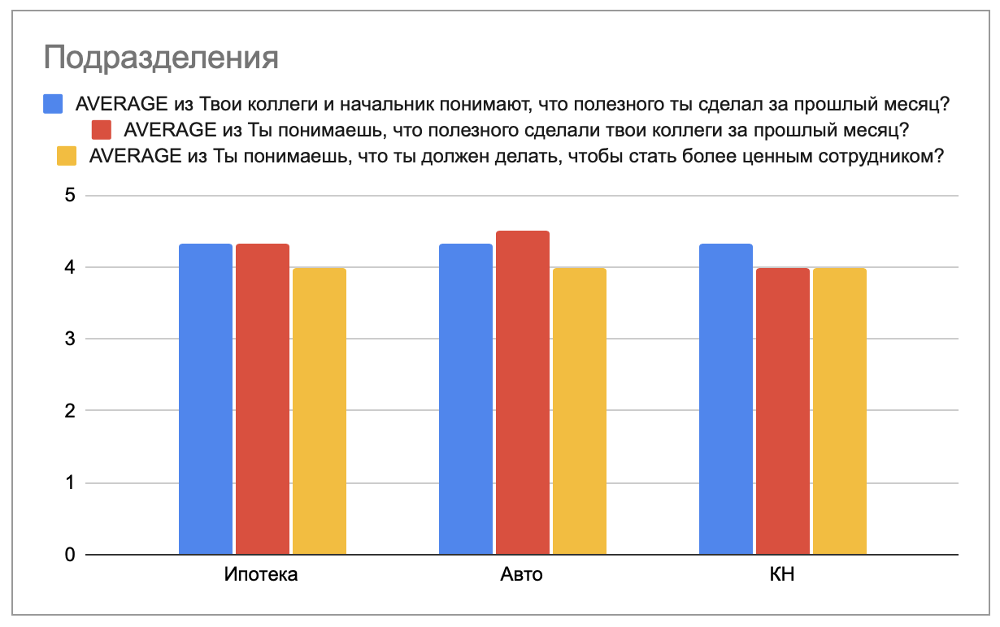
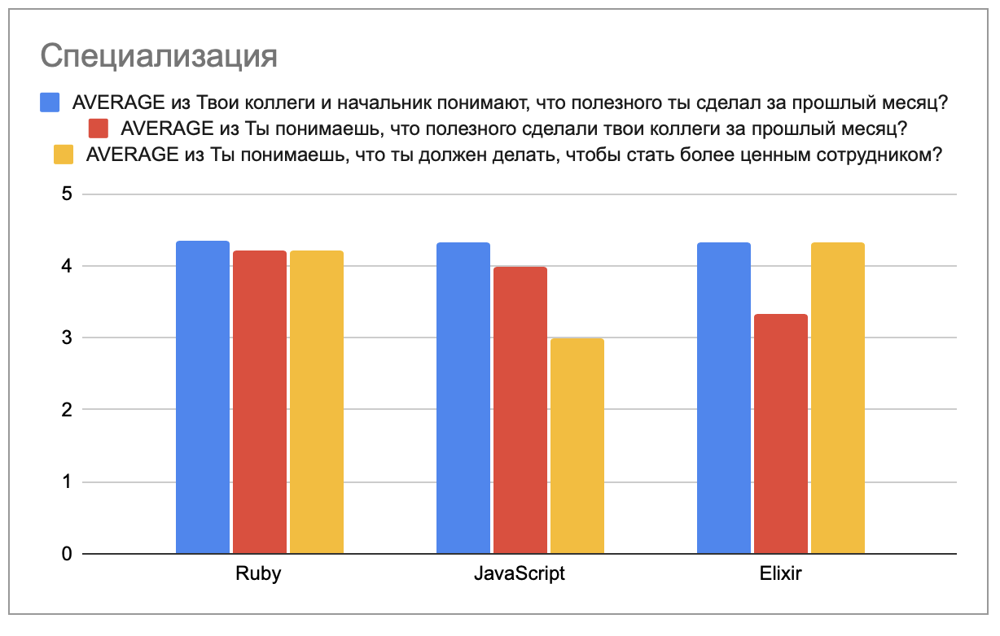

<!--
_paginate: false
_class: lead
-->

# Личные достижения

Сергей Удалов

---

# Вопросы

* Твои коллеги и начальник понимают, что полезного ты сделал за прошлый месяц?
* Ты понимаешь, что полезного сделали твои коллеги за прошлый месяц?
* Ты понимаешь, что ты должен делать, чтобы стать более ценным сотрудником?

https://forms.gle/qhaf7u4Fw2pDLMyK8

---

# Почему это важно?

<!--
Начальник принимает решения о повышении, премии, назначении.

-->

---

# Сейчас

* стендапы
* команды
* tempo
* впечатления

---

# Сложности

* команды
* начальник <--> сотрудник
* задача <--> сотрудник
* неявный вклад
* сложно мерить то, что значимо

---

<table>
<tr>
<td>

</td>
<td>

</td>
</tr>
</table>

<!-- 

https://is.gd/JpttNc

-->

---

# Проблемы

* субъективная оценка
* уравниловка
* непонятна динамика

<!--

Назову лишь некоторые

-->
---

# Фиксация своих достижений

<!--

- лучше всего знаешь, что сделал
- похвалиться
- важная

-->

---

# Список достижений

| Достижение                                            | Ценность |
|-------------------------------------------------------|----------|
| Сделана задача на разработку                          | 10       |
| Найдена ошибка безопасности                           | 20       |
| Найдена ошибка                                        | 5        |
| Доработка в общий сервис                              | 20       |
| Улучшено состояние кода, читаемость                   | 10       |
| Автоматизирован ручной процесс                        | 50       |

<!--

можно вводить любые достижения, которые сложно измерить автоматом:

- code review
- мониторинг
- общие сервисы

-->

---

# Признание 

---

# Конкурентная среда

---

# Развитие

---

# Динамика

<!--
- развитие джуна
- проседание производительности
- я лучше или хуже?
-->

---

# Поиск проблем

---

# Побочные эффекты

<!--
- работа через jira
- декомпозиция
-->

---

# Неудобные вопросы

* индустрия
* "проигравшие"
* личное vs команда
* злоупотребление

---

# Бюрократия

---

slack: @udalov

