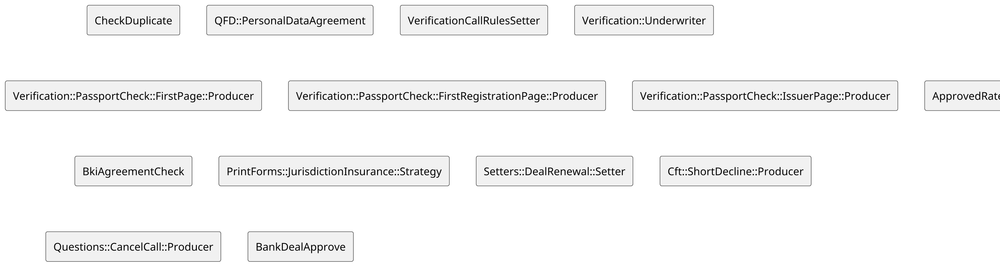
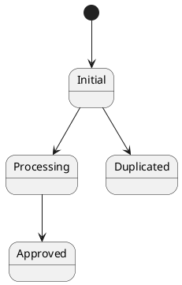
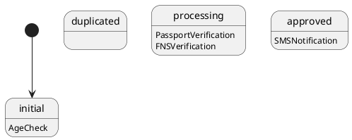
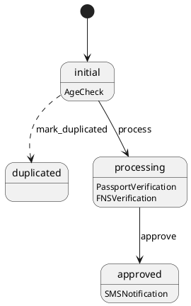
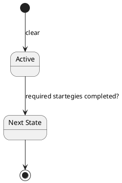
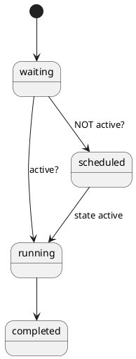
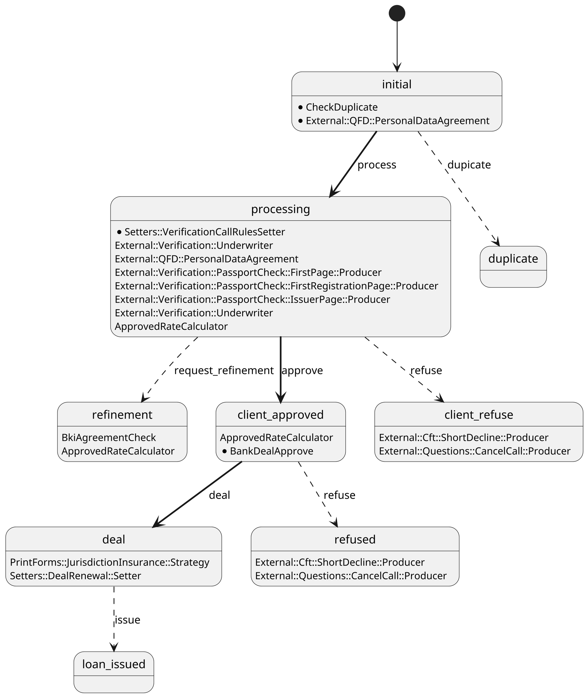

<style>
  section {
    background: #f2f2f2;
  }
  h1,body,li,p { color: black; }

  h1 {
    text-decoration: underline;
    text-decoration-color: #FF5028;
    text-underline-offset: 0.3em;
    text-decoration-thickness: 0.1em;
    padding-bottom: 0.3em;
  }
  img {
    display: block;
    margin-left: auto;
    margin-right: auto;
    max-height: 70%;
    max-width: 100%;
  }
</style>
<!--
_paginate: false
_class: lead
-->


# Core. State Machine

Sergei O. Udalov

---

# Intro 

  * Form
  * Field
  * Strategy
  * ABAC


---

# Field

```ruby
{ name: :name, required: true, validators: [CamelCasedStringValidator] },
{ name: :age, required: true, validators: [NummericValidator, AgeValidator] },
```

---

# Strategy

```ruby
class AgeCheck < Strategy
  FIELDS = %w( age )

  def call(payload)
    if payload[:age] < 18
      apply_strategy form_status: :declined
    else
      apply_strategy
    end
  end
end
```

---

# Lot of Strategies




<!-- 
* Strategies are grouped
* Kind of status

-->

---

# Before

---

<!-- header: Before -->


# Form Status Field

```ruby
{ name: :status, required: true },
```


---

# Status Condition

```ruby
class TariffCalculator < Strategy
  FIELDS = %w( status loan_amount channel loan_purpose )

  class Rule
    def self.call(payload)
      payload[:status] == 'initial'
    end
  end

  def call(payload)
    # ...
    appply_strategy tariff_name: tariff_name, status: :processing
  end
end
```

---

# Issues

  * No state machine 


---

<!-- header: "" -->

# State Machine





---

# AASM

```ruby
class Form
  include AASM

  aasm do
    state :initial, initial: true
    state :processing
    state :duplicated
    state :approved

    event :process do
      transitions from: :new, to: :processing
    end

    event :mark_duplicated do
      transitions from: :new, to: :duplicated
    end

    event :approve do
      transitions from: :processing, to: :approved
    end
  end
end
```

---

# State Strategies

```ruby
aasm do
  state :initial, strategies: [
    'AgeCheck' => {}
  ], initial: true
  state :duplicated
  state :processing, strategies: [
    'PassportVerification' => {},
    'FNSVerification' => {},
  ]
  state :approved, strategies: [
    'SMSNotification' => {},
  ]
end
```

<!--
Strategy runs only if required state is active
-->

---





---

# Transitions


```ruby
aasm do
  # states
  # ...

  event :process do
    transitions from: :new, to: :processing
  end

  event :mark_duplicated do
    transitions from: :new, to: :duplicated
  end

  event :approve do
    transitions from: :processing, to: :approved
  end
end
```

---

# Manual Transition

```ruby
apply_strategy event_machine_event: :mark_duplicated
```

<!-- 
check if event exists
-->

---


---

# Base Line Transition

```ruby
state :processing, strategies: [
  'PassportVerification' => { required: true }, # <-- HERE
  'FNSVerification' => {},
], on_complete: :approve # <-- AND HERE
end
```

---



---

# State Processing





---

# Scheduler





---

# More Complex

```ruby
class DemoStateMachine < CashCore::StateMachines::StateMachineInstance
  include AASM

  aasm with_klass: CashCore::StateMachines::StateMachine do
    state :initial, strategies: [
      { 'CheckDuplicate' => { required: true } },
      { 'External::QFD::PersonalDataAgreement' => { required: true } },
    ], on_complete: :process, initial: true
    state :duplicate
    state :processing, strategies: [
      { 'Setters::VerificationCallRulesSetter' => { required: true } },
      { 'External::Verification::Underwriter' => {} },
      { 'External::QFD::PersonalDataAgreement' => {} },
      { 'External::Verification::PassportCheck::FirstPage::Producer' => {} },
      { 'External::Verification::PassportCheck::FirstRegistrationPage::Producer' => {} },
      { 'External::Verification::PassportCheck::IssuerPage::Producer' => {} },
      { 'External::Verification::Underwriter' => {} },
      { 'ApprovedRateCalculator' => {} },
    ], on_complete: :approve

    state :refinement, strategies: [
      { 'BkiAgreementCheck' => {} },
      { 'ApprovedRateCalculator' => {} },
    ]

    state :deal, strategies: [
      { 'PrintForms::JurisdictionInsurance::Strategy' => {} },
      { 'Setters::DealRenewal::Setter' => {} },
    ]

    state :refused, strategies: [
      { 'External::Cft::ShortDecline::Producer' => {} },
      { 'External::Questions::CancelCall::Producer' => {} },
    ]

    state :client_approved, strategies: [
      { 'ApprovedRateCalculator' => {} },
      { 'BankDealApprove' => { required: true } },
    ], on_complete: :deal
    state :client_refuse, strategies: [
      { 'External::Cft::ShortDecline::Producer' => {} },
      { 'External::Questions::CancelCall::Producer' => {} },
    ]
    state :loan_issued

    event :dupicate do
      transitions from: :initial, to: :duplicate
    end

    event :process do
      transitions from: :initial, to: :processing
    end

    event :request_refinement do
      transitions from: :processing, to: :refinement
    end

    event :approve do
      transitions from: :processing, to: :client_approved
    end
    event :deal do
      transitions from: :client_approved, to: :deal
    end

    event :issue do
      transitions from: :deal, to: :loan_issued
    end

    event :refuse do
      transitions from: :client_approved, to: :refused
      transitions from: :processing, to: :client_refuse
    end

  end

  def self.state_field
    :form_status
  end
end
```

---


```bash
rake app:cash_core:state_machine:plantuml[CurrentStateMachine]
```

---



<!--
* required strategies are marked
* clickable
* forms number
* form details

-->


---

# Thank you!


---

# Bonus!

---

```cucumber
Feature: Strategy

  Strategy is a amount of work that should be executed when
  trigger on a form is fired. As a result it could update 
  form fields.


  Scenario: Field age is updated and subscribed strategy AgeChecker is executed

    Given a form type with fields
      | Name |
      | age  |

    And a form
    And I put "30" into "age" field

    Given strategy "AgeChecker"
    And strategy "AgeChecker" is subscribed on "age"

    When I put "30" into "age" field
    Then strategy "AgeChecker" is executed "0" time(s)

    When I put "31" into "age" field
    Then strategy "AgeChecker" is executed "1" time(s)
```

---

# Open Source

source: https://gitlab.infra.b-pl.pro/lib/core
IR: https://jira.balance-pl.ru/browse/IR-5141
