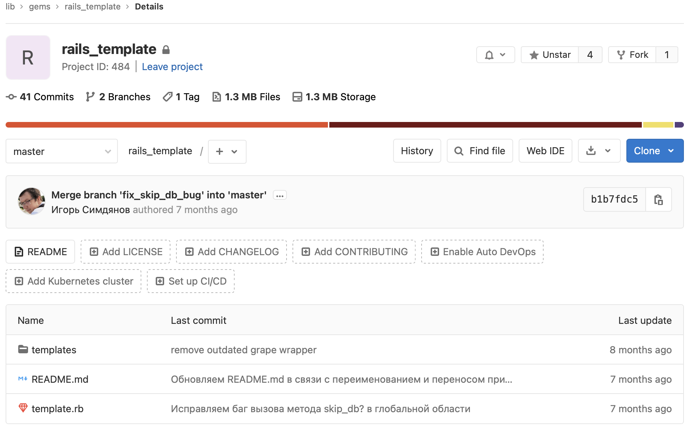
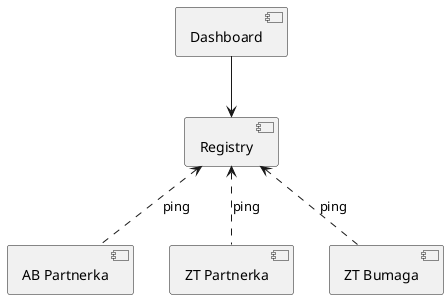

<style>
  section {
  }
  h1,body,li,p { color: black; }

  h1 {
    text-decoration: underline;
    text-decoration-color: #FF5028;
    text-underline-offset: 0.3em;
    text-decoration-thickness: 0.1em;
    padding-bottom: 0.3em;
  }
  img {
    display: block;
    margin-left: auto;
    margin-right: auto;
    max-width: 90%;
  }
</style>
<!--
_paginate: false
_class: lead
-->


# Ruby Platform

Sergei O. Udalov

---
<!-- footer: Ruby Platform -->

# Intro

---

<!-- header: Intro -->

```plantuml
component "Project A" {

  [Application] #CC342D
  [Auth]
  [Reports]
  [Documents]
  
}

component DocumentsModule as "Documents" {
  [A] #CC342D
  [B]
  [SM1] AS "SM" #CC342D
}

Documents ..> DocumentsModule

component ReportsModule as "Reports" {
  [C]
  [D] #CC342D
  [SM2] AS "SM" #CC342D
}

Reports ..> ReportsModule

component Platform {

  [SM3] as "SM" #CC342D
  [Crypto] #CC342D
  [Other] #1199FF
  
}

SM1 ..> SM3
SM2 ..> SM3

hide Platform
hide ReportsModule
hide DocumentsModule
```

---
```plantuml
component "Project A" {

  [Application] #CC342D
  [Auth]
  [Reports]
  [Documents]
  
}

component DocumentsModule as "Documents" {
  [A] #CC342D
  [B]
  [SM1] AS "SM" #CC342D
}

Documents ..> DocumentsModule

component ReportsModule as "Reports" {
  [C]
  [D] #CC342D
  [SM2] AS "SM" #CC342D
}

Reports ..> ReportsModule

component Platform {

  [SM3] as "SM" #CC342D
  [Crypto] #CC342D
  [Other] #1199FF
  
}

SM1 ..> SM3
SM2 ..> SM3
hide Platform
```

---

```plantuml
component "Project A" {

  [Application] #CC342D
  [Auth]
  [Reports]
  [Documents]
  
}

component DocumentsModule as "Documents" {
  [A] #CC342D
  [B]
  [SM1] AS "SM" #CC342D
}

Documents ..> DocumentsModule

component ReportsModule as "Reports" {
  [C]
  [D] #CC342D
  [SM2] AS "SM" #CC342D
}

Reports ..> ReportsModule

component Platform {

  [SM3] as "SM" #CC342D
  [Crypto] #CC342D
  [Other] #1199FF
  
}

SM1 ..> SM3
SM2 ..> SM3

```

---

# Ruby Platform

```plantuml

component Cryptopro {
  [RubyPlatform] as "Ruby Platform" #CC342D
  [Logic] -down-> RubyPlatform
}

component SM {
  [RubyPlatform2] as "Ruby Platform" #CC342D
  [Logic2] as "Logic"

  Logic2 -down-> RubyPlatform2
}

```

---

<!-- header: "" -->

# Why?

* bootstrap
* best practices

---

# Challenges

* deliver updates
* lot of apps
 

---

# Bootstrap

`rails new new-app-name -m http://example.com/template`

---

# Best Practices. Part 1

* configs
* testing & coverage
* dev tools
* linters & other checks
* docker builds

---

# Best Practices. Part 2

* feature toggling
* high availability
* conntection pool, reconnect
* background jobs 
* cron scheduler

<!--

* Redis Sentinel
* RMQ cluster

-->

---

# Best Practices. Part 3

* RPC
* healthcheck
* monitoring
* error handling
* docs

<!-- generate docs, export -->

---

# Best Practices. Part 4

* logging
* auth
* anlytics

---

# rails_template




<!-- why rails template -->

---

<!-- header: Rails Template -->

# Gems

```ruby
gem_group :development, :test do
  gem "rspec-rails"
  gem "bp-platform-development"
end

gem "bp-platform"
```

---

# Tasks

```ruby
generate(:scaffold, "person name:string")
```

---

# Files

```ruby
file 'app/components/foo.rb', <<-CODE
  class Foo
  end
CODE
```
---

# Docs

https://guides.rubyonrails.org/rails_application_templates.html

---

<!-- header: "" -->

# What's wrong?

* bootstrap only
* no update process
* unknown status

---

# Updates

---

<!-- header: Updates -->

```ruby
bin/rails app:template LOCATION=http://example.com/template.rb
```

---

# Heatmap

| Project | App       | Platform | Ruby | Redis |
|---------|-----------|----------|------|-------|
| AB Auto | partnerka | 1.0      | 2.4  | no    |
| ZT Auto | partnerka | 1.1      | 2.6  | yes   |
| ZT Auto | bumaga    | 1.9      | 3.2  | no    |

---

# Monitoring



---

# Update Notes

* changelog
* manual actions

---

<!-- header: "" -->

# Efficency

* grape
* sinatra / roda / hanami
* rom-rb

<!-- We have updates, so we can move -->

---

# Mount Rack

```ruby

match "/api" => MySinatraApp, anchor: false

```

---

# Background Jobs

```ruby
class MegafonResponseWorker < BP::Platform::ResponseWorker
  queue :megafon
  
  def work(data)
    # ...
  end
end 
```

---

# Up to Date

* ruby version
* gems

---

# New Features


---

<!-- header: "" -->

# Summary

* bootstrap
* best practices
* deliver updates

---

# What Next?

* improve rails_template
* gem template
* python
* php
* etc..

---

# Links

* https://guides.rubyonrails.org/rails_application_templates.html
* https://gitlab.infra.b-pl.pro/lib/gems/rails_template
* https://github.com/sergio-fry/slides/blob/master/ruby-platform/slides.md

---

# Thanks!
