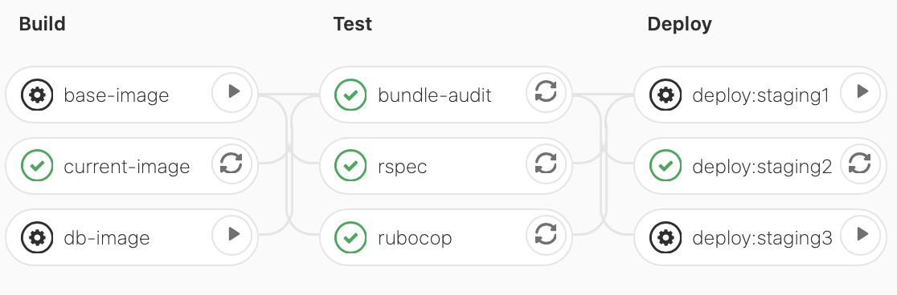
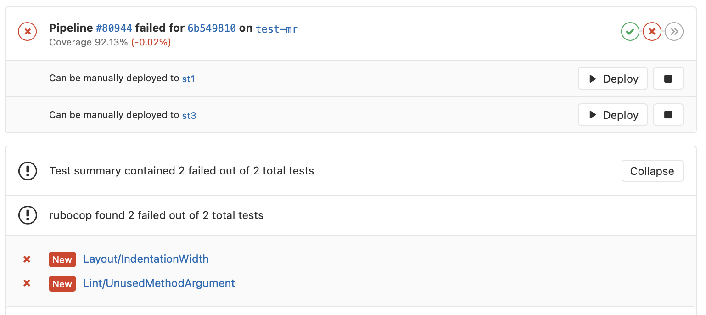
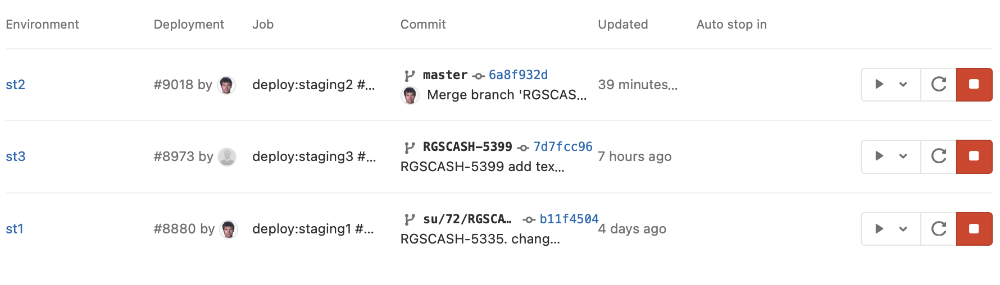
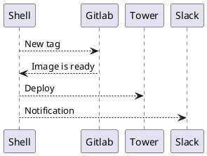
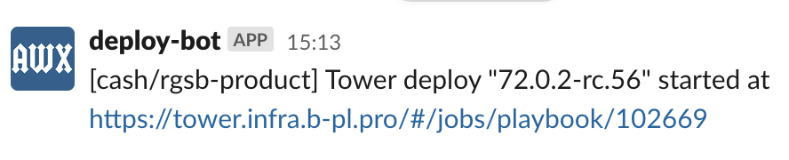

<style>
  section {
    background: white;
  }
</style>
<!--
_paginate: false
_class: lead
-->


# Cash. CI/CD

Sergei O. Udalov

---

<!-- footer: Cash. CI/CD. Sergei O. Udalov -->

# Why?

- quality check
- delivery
- documentation


---

# Quality Check

- test + coverage
- lint
- security issues

---

# Delivery

- build image
- continious deliver
- manual deployments

---

# Stages




---


# Instant Results




---

# Instant Results

```yaml

  script:
    - rubocop || true
    - rubocop --format junit --display-only-failed --out rubocop.xml

  artifacts:
    paths:
      - rubocop.xml
    reports:
      junit: rubocop.xml
```

---

# Deployment History



---

# Deployment History

```yaml
deploy:staging1:
  stage: deploy
  needs: ["current-image"]
  when: manual
  interruptible: true
  environment:
    name: st1

```

--- 

# DRY

```yaml
current-image:
  <<: *docker
  stage: build
  script:
    - docker build --pull --build-arg BASE_APP_IMAGE=$IMAGE:base-$BA...
    - docker push $IMAGE:$CI_COMMIT_SHORT_SHA
```


---


# Documentation

```yaml
before_script:
  - bundle exec rake db:create
  - bundle exec rake db:setup:all

script:
  - bundle exec rspec spec
```

---

# Спасибо!

--- 

# Bonus


---

# Gitlab CI + Tower

<center>


</center>

---

<!-- header: Gitlab CI + Tower -->

# Shell

```shell
$ lead release bump
72.0.2-rc.56
...
Waiting job to build tag "72.0.2-rc.56" https://gitlab.infra.b-pl.pro/cash/rgsb-product/-/jobs/298596
.............................
Tower deploy "72.0.2-rc.56" started at https://tower.infra.b-pl.pro/#/jobs/playbook/102669
```

---

# Slack



---

# Еще раз спасибо!
