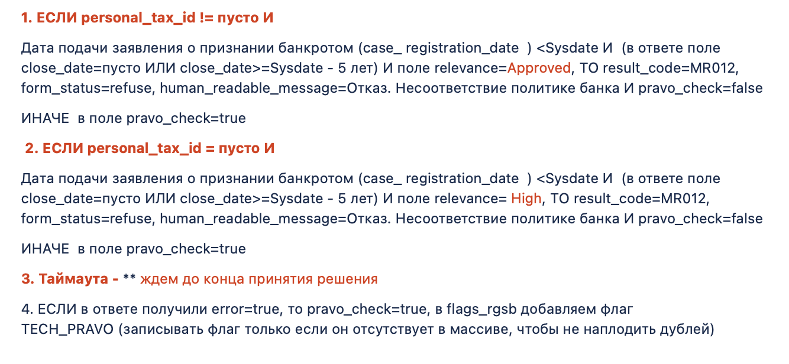

<style>
  section {
    background: white;
  }
</style>

<!--
_paginate: false
_class: lead
-->


# КН. Документация

Серей Удалов

---

<!-- footer: КН. Документация. Сергей Удалов -->


# О чем пойдет речь

- Что программируем
- История документации
- Где мы сейчас
- Планы

---

<!-- header: Что программируем -->

# Общие сервисы

- Мегафон
- Вопросник


---

# API

- обновление / создание заявки
- список / поиск по заявкам
- просмотр заявки
- несколько интеграций

---

# Стратегии

```ruby
class SuitableAgeChecker < Strategy
  def call(payload)
    apply_strategy(has_age_suitable: payload[:age] > 18)
  end
end
```

---

<!-- header: История документации -->

# Documentation Driven


---

# Детальное описание



---

<!-- header: Где мы сейчас -->

# Статус

|                     | Статус   | Описание                          |
|---------------------|----------|-----------------------------------|
| API                 | ОК       | Хорошее, либо не требуется        |
| Стратегии           | **FAIL** | Устарело. Аналитики не имеют полной картины |


---

<!-- header: "" -->

# Планы 

* Генерация документации
* Инструменты анализа
* Краткое описание, а не полное, но актуальное

---

# Спасибо

