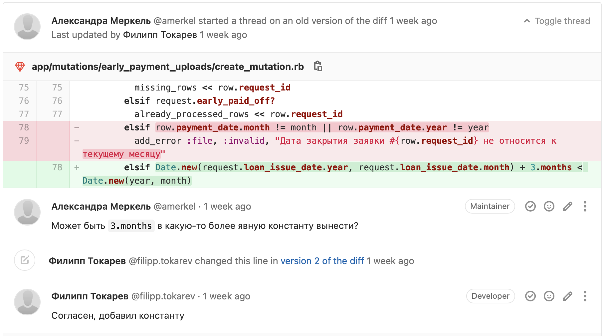

<style>
  section {
    background: #f2f2f2;
  }
  h1,body,li,p { color: black; }

  h1 {
    text-decoration: underline;
    text-decoration-color: #FF5028;
    text-underline-offset: 0.3em;
    text-decoration-thickness: 0.1em;
    padding-bottom: 0.3em;
  }
  img {
    display: block;
    margin-left: auto;
    margin-right: auto;
    max-width: 90%;
  }
</style>
<!--
_paginate: false
_class: lead
-->


# Code Review

Сергей Удалов

---

# Что такое Codereview?

---

<!-- header: Что такое Codereview? -->




---
<!-- header: "" -->

# Цели

* увеличение качества кода
* увеличение bus factor
* обмен опытом, обучение
* сообщество

---

```ruby
class User
end
```

---

# Оформление MR

* Gitlab
* CI сборка прошла
* MR привязан к задаче

---

# Задачи ревьюера

* корректность 
* оптимальность
* поддерживаемость
* избыточность


<!-- _footer: "Что нужно проверить" -->

---

# Обсуждение

* уважение к мнению автора
* советуем, а не требуем
* разделем код и автора
* дать объяснение, почему лучше так
* даем позитивную обратную связь

---

# Обучение

* обмен опытом
* знание проекта
* переиспользование кода
* чтение чужого кода

---

# Проблемы

* требуется дополнительное время
* токсичность
* отвелчение разработчиков
* мало разработчиков в проекте
* размытие ответственности

---

# SLA

* 1 день
* высокий приоритет задачам на ревью

---

# Best Practices

* изучить весь MR
* автоматические проверки качества
* выделение проблемы в новые задачи техдолг, если сейчас нужно срочно
* Размер MR должен быть небольшим
* привелечение нескольких участников
* отслеживать все изменения в проекте
* лучшее - враг хорошего

---

# RFC-7

Confluence: Architecture / RFC/ADR / Список RFC / [RFC-7] Codereview

slack: #arch

---

# Спасибо!
