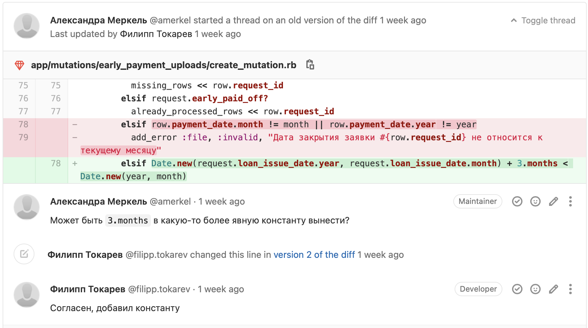
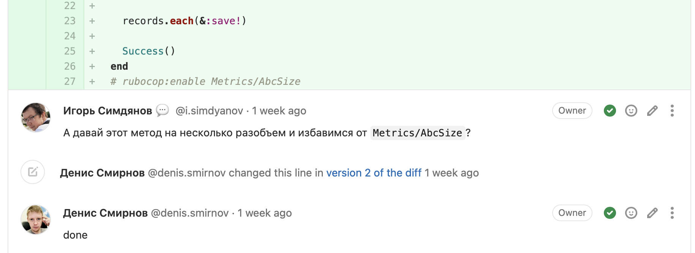

<!--
_paginate: false
_class: lead
-->

# Code Review

Сергей Удалов

---

# Что это такое?

---

<!-- header: Что это такое? -->

---

---
<!-- header: "" -->

# Цели

* найти дефекты
* качество кода
* увеличить "Bus Factor"
* обучение
* сообщество

---

# Обучение

* обмен опытом
* знание проекта
* переиспользование кода

---

# Недостатки

* требуется дополнительное время
* токсичность

---

# Best Practices

* CI green
* автоматические проверки качества
* уважение к мнению автора
* советуем, а не требуем
* разделем код и автора

---

# Checklist

* старый код не сломан
* задача выполнена корректно и в полном объеме
* производительность не ухудшилась
* поддерживаемость не ухудшилась
* код соответствует принятым критериям качества
* идеи для улучшения

