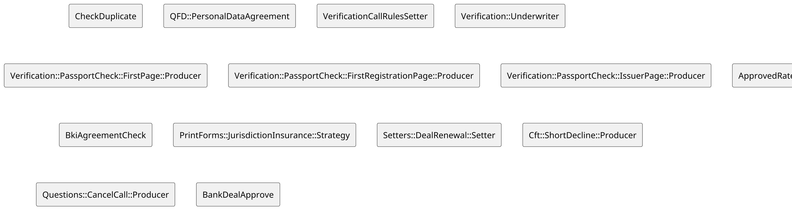

<style>
  section {
    background: #f2f2f2;
  }
  h1,body,li,p { color: black; }

  h1 {
    text-decoration: underline;
    text-decoration-color: #FF5028;
    text-underline-offset: 0.3em;
    text-decoration-thickness: 0.1em;
    padding-bottom: 0.3em;
  }
  img {
    display: block;
    margin-left: auto;
    margin-right: auto;
    max-height: 70%;
    max-width: 100%;
  }
</style>
<!--
_paginate: false
_class: lead
-->


# Core. State Machine

Sergei O. Udalov

---

# Intro 

  * Form
  * Field
  * Strategy
  * ABAC


---

# Field

```ruby
{ name: :name, required: true, validators: [CamelCasedStringValidator] },
{ name: :age, required: true, validators: [NummericValidator, AgeValidator] },
```

---

# Strategy

```ruby
class AgeCheck < Strategy
  FIELDS = %w( age )

  def call(payload)
    if payload[:age] < 18
      appply_strategy form_status: :declined
    else
      appply_strategy
    end
  end
end
```

---

# Lot of Strategies



---

# Before

---

<!-- header: Before -->


# Form Status Field

```ruby
{ name: :status, required: true },
```


---

# Status Condition

```ruby
class TariffCalculator < Strategy
  FIELDS = %w( status loan_amount channel loan_purpose )

  class Rule
    def self.call(payload)
      payload[:status] == 'initial'
    end
  end

  def call(payload)
    # ...
    appply_strategy tariff_name: tariff_name, status: :processing
  end
end
```

---

# Issues

  * No state machine 


---

<!-- header: "" -->

# AASM

```ruby
class Form
  include AASM

  aasm do
    state :new, initial: true
    state :processing
    # ...

    event :process do
      transitions from: :new, to: :processing
    end

    # ...
  end
end
```

---

# State Strategies

```ruby
aasm do
  state :new, strategies: [
    'AgeCheck' => {}
  ]
  state :processing, strategies: [
    'PassportVerification' => {},
    'FNSVerification' => {},
  ]
  state :approved, strategies: [
    'SMSNotification' => {},
  ]
end
```


---

# Transitions


```ruby
aasm do
  state :new, strategies: [
    'AgeCheck' => { required: true }
  ], on_complete:
  state :processing, strategies: [
    'PassportVerification' => { required: true },
    'FNSVerification' => {},
  ]
  state :approved, strategies: [
    'SMSNotification' => {},
  ]
end
```

---

# Default Transition

---

# Manual Transition

---

# Diagram

---

# Thank you!
