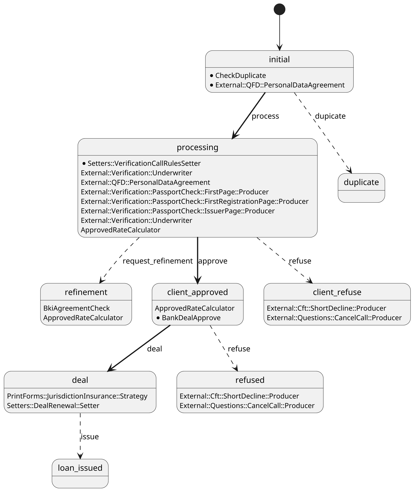

<style>
  section {
  }
  h1,body,li,p { color: black; }

  h1 {
    text-decoration: underline;
    text-decoration-color: #FF5028;
    text-underline-offset: 0.3em;
    text-decoration-thickness: 0.1em;
    padding-bottom: 0.3em;
  }
  img {
    display: block;
    margin-left: auto;
    margin-right: auto;
    max-width: 90%;
    max-height: 70%;
  }
</style>
<!--
_paginate: false
_class: lead
-->


# Core

Сергей Удалов

---

# Intro 

  * Form
  * Field
  * Strategy
  * ABAC
  * Search
  * Validation
  * HTTP API

---

# Form

---

# Field

```ruby
{ name: :name, required: true, validators: [CamelCasedStringValidator] },
{ name: :age, required: true, validators: [NummericValidator, AgeValidator] },
```

---

# ABAC. CRUD notation

go_agent.acl
```
abroad_insurance_photo:CRU
additional_info_step_done:CRU
additional_monthly_income:CRU
additional_phone:CRU
address_de_facto:CRU
agreement_for_additional_services:CRU
anketa_verification_sent_at:CU
approved_rate_gybrid:R
...
```

---

# ABAC. Scope

```ruby
# form_policy.rb
def go_agent(invoker:, scope:)
  form_statuses = ['new', 'initial', 'refinement', nil]
  scope = scope.where(form_status: form_statuses)
end
```

---

# Strategy

```ruby
class AgeCheck < Strategy
  FIELDS = %w( age )

  def call(payload)
    if payload[:age] < 18
      apply_strategy form_status: :declined
    else
      apply_strategy
    end
  end
end
```

---

# Product

```plantuml
package "Product" {
  component Core {
  }

  component Configuration {
    [Fields]
    [Timeouts]
    [Retries]
    [ABAC]
  }

  [NBKIStrategy]
  [MegafonStrategy]
  [DocumentsStrategy]


  Core --> Configuration
}
database DB
Core -up-> DB

() HTTP
HTTP -- Core

rectangle "Megafon"
MegafonStrategy <--> Megafon: RMQ

rectangle DataHunter
NBKIStrategy <--> DataHunter: RMQ

rectangle Bumaga
DocumentsStrategy --> Bumaga: HTTP

```


---

# State Strategies

```ruby
aasm do
  state :initial, strategies: [
    'AgeCheck' => {}
  ], initial: true
  state :duplicated
  state :processing, strategies: [
    'PassportVerification' => {},
    'FNSVerification' => {},
  ]
  state :approved, strategies: [
    'SMSNotification' => {},
  ]
end
```

<!--
Strategy runs only if required state is active
-->


---




---

# Спасибо!

