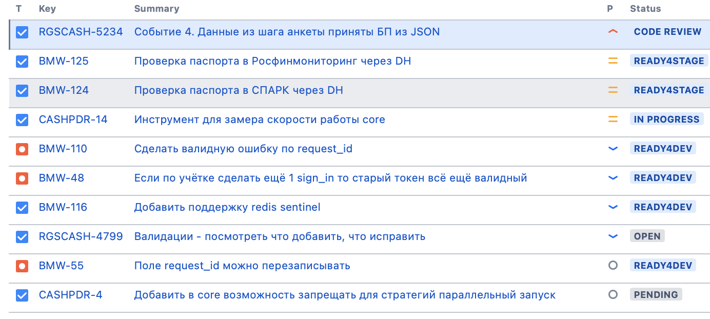

<!--
_paginate: false
_class: lead
-->

# Jira

Sergei O. Udalov

---

<!-- footer: Jira. Sergei O. Udalov -->

# Business Values

* deliver issue
* scale
* stable
* improve

---

# Chat Driven Development

* no description
* no priorities
* polling
* chat ninja is required
* does **not scale**

---

<!-- header: Chat Driven Development -->

# Energy

---

<!-- header: "" -->

# Boring

---

# Create issue, please!

1. delegate
2. prioritize
3. subscribe

---

# It shoud be clear...

* **what** to do
* **how** to do
* how to **test**
* .. and be **compact**

---

# Tips

* keep description up to date
* update status 
* write comments
* read comments
* your issues are yours
* respect priorities

---

# Communicate

* **comment** with mention
* **assign** to notify if mention is ignored
* wait for response, please

---

# Notifications

* respect email
* prioritize
* digest
* ignore

---

# Thanks!
