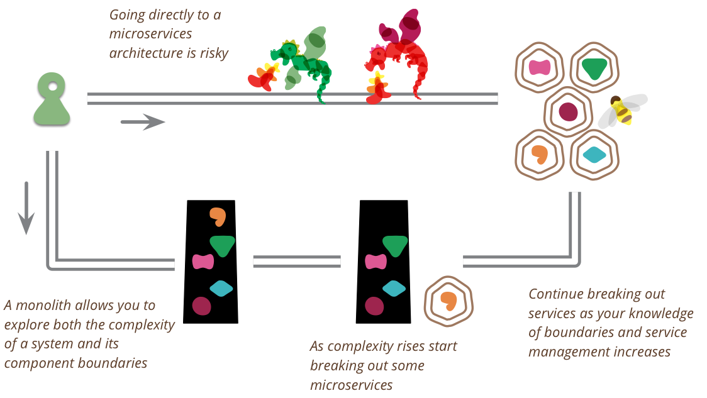

<style>
  section {
  }
  h1,body,li,p { color: black; }

  h1 {
    text-decoration: underline;
    text-decoration-color: #FF5028;
    text-underline-offset: 0.3em;
    text-decoration-thickness: 0.1em;
    padding-bottom: 0.3em;
  }
  img {
    display: block;
    margin-left: auto;
    margin-right: auto;
    max-width: 90%;
  }
</style>
<!--
_paginate: false
_class: lead
-->


# Monolith vs Microservices


Sergei O. Udalov

---

# Intro

---

# Pros

* scaling
* fail tolerant
* reusable
* ease of deployment
* organization alignment
* heterogeneity
* replaceability

---

```plantuml

package "Monolith" as monolith {
  [API] as api
  [Model] as model
  database "DB" as db

  api -down-> model
  model -down-> db
}

package "Microservice Architecture" as microservices {
	package "Service 1" {
	  [API] as api1
	  [Model] as model1
	  database "DB" as db1

	  api1 -down-> model1
	  model1 -down-> db1
	}

	package "Service 2" {
	  [API] as api2
	  [Model] as model2
	  database "DB" as db2

	  api2 -down-> model2
	  model2 -down-> db2
	}

	package "Service 3" {
	  [API] as api3
	  [Model] as model3
	  database "DB" as db3

	  api3 -down-> model3
	  model3 -down-> db3
	}
}


```

---

# Storage Layer

```plantuml

	package "Service 2" {
	  [API] as api2
	  database "DB" as db2

	  api2 -down-> db2
	}

	package "Service 1" {
	  [API] as api1
	  [Model] as model1

	  api1 -down-> model1
	  model1 -right-> api2
	}


```

---

# Boundaries

* stable
* refactoring

---

# Testing

* independent deployment
* testing in isolation

---

# Team

* size
* heterogeneity

---

# Extra Complexity

* communications
* DevOPS
* release
* architecture

---

# Core Platform

* Documents
* Заявка
* Логирование
* Валидация и оценка

---

# Quotes

---

<!-- header: Monolith First. Martin Fowler -->

# Monolith First

* Almost all the successful microservice stories have started with a monolith that got too big and was broken up
* Almost all the cases where I've heard of a system that was built as a microservice system from scratch, it has ended up in serious trouble.

<!-- footer: https://martinfowler.com/bliki/MonolithFirst.html -->

---

> This pattern has led many of my colleagues to argue that you shouldn't start a new project with microservices, even if you're sure your application will be big enough to make it worthwhile. .

---




---

<!-- header: Builing Microservices. Sam Newman -->


<!-- footer: "" -->

---

> Но на начальном этапе нужно сохранять монолитность новой системы

---

> Во многих отношениях куда проще иметь весть исходный код, требующий декомпозиции и разбиения на микросервисы, чем пытаться создавать микросервисы с самого начала.

---

<!-- header: Builing Microservices. "" -->

# Summary

---

# Links

- https://martinfowler.com/bliki/MonolithFirst.html
- https://github.com/sergio-fry/slides/tree/master/microservices
- Building Microservices, Sam Newman

---

# Thanks!
