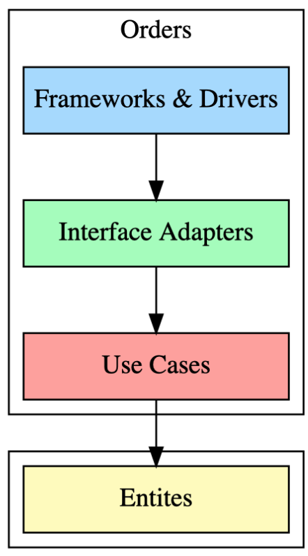

<!-- _paginate: false -->

# Modular Ruby app

Sergei O. Udalov

---

# Clean Architecture

---

# Fullstack Module

@startuml
skinparam dpi 200

digraph G {
  node [shape="box" style="filled" width="2"]

  subgraph cluster3 {
    entities [label="Entites" fillcolor="#FEFBBA" width="2"];
  }

  subgraph cluster1 {
    label = "Orders";

    use_cases [label="Use Cases" fillcolor="#FFA09B"]
    interface_adapters [label="Interface Adapters" fillcolor="#A2FDBA"]
    framework_drivers [label="Frameworks & Drivers" fillcolor="#A4D8FF"]

    framework_drivers -> interface_adapters;
		interface_adapters -> use_cases;
    use_cases -> entities;
	}
} 
@enduml

---

# Fullstack Module

@startuml
skinparam dpi 200

digraph G {
  node [shape="box" style="filled" width="2"]

  subgraph cluster3 {
    entities [label="Entites" fillcolor="#FEFBBA" width="3"];
  }

  subgraph cluster1 {
    label = "Orders";

    use_cases [label="Use Cases" fillcolor="#FFA09B"]
    interface_adapters [label="Interface Adapters" fillcolor="#A2FDBA"]
    framework_drivers [label="Frameworks & Drivers" fillcolor="#A4D8FF"]

    framework_drivers -> interface_adapters;
		interface_adapters -> use_cases;
    use_cases -> entities;
	}

  subgraph cluster2 {
    label = "Accounts";

    use_cases2 [label="Use Cases" fillcolor="#FFA09B"]
    interface_adapters2 [label="Interface Adapters" fillcolor="#A2FDBA"]
    framework_drivers2 [label="Frameworks & Drivers" fillcolor="#A4D8FF"]

    framework_drivers2 -> interface_adapters2;
		interface_adapters2 -> use_cases2;
    use_cases2 -> entities;
	}
} 
@enduml

---

# Entities

<table>
<tr>

<td>

</td>

<td>
<pre>
app/entities
app/entities/lib
app/entities/entities.gemspec
</pre>
</td>

</tr>
</table>

---

# Modules

<table>
<tr>

<td>

</td>

<td>
<pre>
app/modules
app/modules/orders
app/modules/accounts
</pre>
</td>

</tr>
</table>

---

# Module
*Use Cases*

<table>
<tr>

<td>

</td>

<td>
<pre>
app/modules
app/modules/orders
app/modules/orders/lib
app/modules/orders/lib/order_creator.rb
app/modules/orders/lib/cart.rb
app/modules/orders/orders.gemspec
</pre>

</td>

</tr>
</table>

---

# Module

*Adapters*

<table>
<tr>

<td>

</td>

<td>
<pre>
app/modules
app/modules/orders
app/modules/orders/lib
app/modules/orders/lib/adapters
app/modules/orders/lib/adapters/orders_repo.rb
app/modules/orders/lib/adapters/order_serializer.rb
app/modules/orders/orders.gemspec
</pre>

</td>

</tr>
</table>

---

# Module

*Frameworks & Drivers*

<table>
<tr>

<td>

</td>

<td>
<pre>
app/modules
app/modules/orders
app/modules/orders/external
app/modules/orders/lib
app/modules/orders/orders.gemspec
</pre>

</td>

</tr>
</table>

---

# Module

*Adapters*

<table>
<tr>

<td>

</td>

<td>
<pre>
app/modules
app/modules/orders
app/modules/orders/lib
app/modules/orders/lib/adapters
app/modules/orders/lib/adapters/orders_repo.rb
app/modules/orders/lib/adapters/order_serializer.rb
app/modules/orders/orders.gemspec
</pre>

</td>

</tr>
</table>

---

# Module

*Frameworks & Drivers*

<table>
<tr>

<td>

</td>

<td>
<pre>
app/modules
app/modules/orders
app/modules/orders/external
app/modules/orders/lib
app/modules/orders/orders.gemspec
</pre>

</td>

</tr>
</table>

---

# Module

*Frameworks & Drivers*

<table>
<tr>

<td>

</td>

<td>
<pre>
orders/external
orders/external/rails_engine
orders/external/rake_tasks
orders/external/workers
</pre>

</td>

</tr>
</table>
