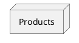
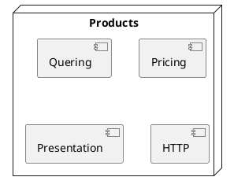
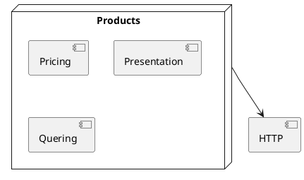
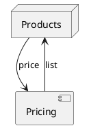

<style>
  section {
    background: white;
  }
  h1,body,li,p { color: black; }

  h1 {
    text-decoration: underline;
    text-decoration-color: #FF5028;
    text-underline-offset: 0.3em;
    text-decoration-thickness: 0.1em;
    padding-bottom: 0.3em;
  }
  img {
    display: block;
    margin-left: auto;
    margin-right: auto;
    width: auto;
    height:70%;
  }
</style>
<!--
_paginate: false
_class: lead
-->


# Extend with Module

Sergei O. Udalov

---




---




---





---

# Why to Extract?

- SRP
- Reuse


---

```ruby
class Products
  def all
    http_get("https://example.com/api/products")
  end

  def request(url, q: {})
    @response = JSON.parse(Faraday.get(url, query(q)))
  end

  def query(q)
    { token: ENV["TOKEN"] }.merge(q)
  end
end
```

---


```ruby
class Products
  include HTTP

  def all
    http_get("https://example.com/api/products")
  end
end

module HTTP
  def request(url, q: {})
    JSON.parse(Faraday.get(url, query(q)))
  end

  def query(q)
    { token: ENV["TOKEN"] }.merge(q)
  end
end
```


---

  - understandable
  - flexible
  - maintainable

---

# Issues

* Incapsulation
* Stateless
* Cyclic Dependencies
* Reuse
* Testing


---

# Incapsulation


---

<!-- header: Incapsulation -->


  * all visible
  * shared state
  * intersaction

---


```ruby
module IndexQueryParamsParts
  DEFAULT_PAGE_SIZE = 100

  def page_size
    params[:page_size] ? params[:page_size].to_i : DEFAULT_PAGE_SIZE
  end

  def field_names
    @field_names ||= Field.where(searchable: true).pluck(:name).map(&:to_s)
  end
end
```

shared state, intersaction


---

```ruby
module QueueLatencyChecker
  def queue_full?(queue)
    return false unless queue_max_latency(queue).present?
    return false unless queue_max_size(queue).present?

    (latency(queue) > queue_max_latency(queue)) || (queue_size(queue) > queue_max_size(queue))
  end

  def latency(queue)
    queue(queue).latency
  end

  def queue_size(queue)
    queue(queue).size
  end

  def queue(queue)
    Sidekiq::Queue.new(queue)
  end

  def queue_max_latency(queue)
    Settings.queue_max_latency[queue]
  end

  def queue_max_size(queue)
    Settings.queue_max_size[queue]
  end
end
```

---


<!-- footer: stlss -->

---

<!-- header: "" -->
<!-- footer: "" -->

# Stateless


---

<!-- header: Stateless -->

  * long arg list
  * no initializer
  * each method is initializer
  * procedural programming

---

```ruby
module MoneyMath
  def self.round_to_cents(cents)
    return if cents.nil?

    cents.to_i / 100 * 100
  end

  # 100.00 -> 100_00
  def self.to_cents(amount)
    return if amount.nil?

    (amount.to_f * 100).to_i
  end

  def self.to_rubs(amount)
    return if amount.nil?

    amount.to_f / 100
  end

  # 5_000_00 -> 5 000
  def self.to_hundreds(amount)
    return if amount.nil?

    amount.to_i / 100
  end
end
```

---


TODO: Alfa Request Validator example

---

<!-- footer: clc dpd -->

---

<!-- header: "" -->
<!-- footer: "" -->

# Cyclic Dependencies

---

<!-- header: Cyclic Dependencies -->

```ruby
module PersistentCcRefuseCode
  CODE = 'MR006С'

  def current_cc_refuse_code
    payload[:credit_card_refuse_code]
  end

  def persistent_cc_refuse_code?
    current_cc_refuse_code == CODE
  end

  def changeable_cc_refuse_code?
    !persistent_cc_refuse_code?
  end
end
```

---





<!-- footer: rse -->

---

<!-- header: "" -->
<!-- footer: "" -->

# Resuse

---

<!-- header: Reuse -->

  * high coupling
  * smooth responsibility

---

```ruby
module FormExistence
  def form_exists?(form_id)
    form_id && CashCore::Form.where(id: form_id).exists?
  end

  def form_exist_errors
    {
      errors: {
        form_id: I18n.t(:exists, scope: 'errors.messages'),
      },
    }
  end
end
```

---


```ruby
module WebDefaults
  ALLOWED_SALES_CHANNEL_IDS = [2, 3, 5, 9]

  def with_web_default_fields(raw_params, sales_channel_id)
    return raw_params unless sales_channel_id.to_i.in?(ALLOWED_SALES_CHANNEL_IDS)

    raw_params.dup.reverse_merge!(
      {
        tariff_name: tariff_name(raw_params[:tariff_default]),
      }
    )
  end

  private

  def tariff_name(tariff_default)
    tariff_default&.downcase == 'партнерский' ? 'Партнерский' : 'Гибрид'
  end
end
```

---

<!-- footer: tst -->

---

<!-- header: "" -->

# Testing

---

<!-- header: Testing -->

  * difficult to test
  * no separate tests
  * DRY tests
  * missing tests

---

<!-- header: "" -->


# Class Inside


---

<!-- header: "Class Inside" -->


* Where is implementation?
* No constructor


```ruby
class CreateFieldsForm < Web::BaseSchema
  include TariffCalculator
  include DadataFields
  include WebDefaults
  include FormExistence
  include CodeNumberCheck
  include VerificationFields
  include CrmpRequest
  include PartnerData
end
```

---


# Other

* Why
* Naming

---

# Examples

