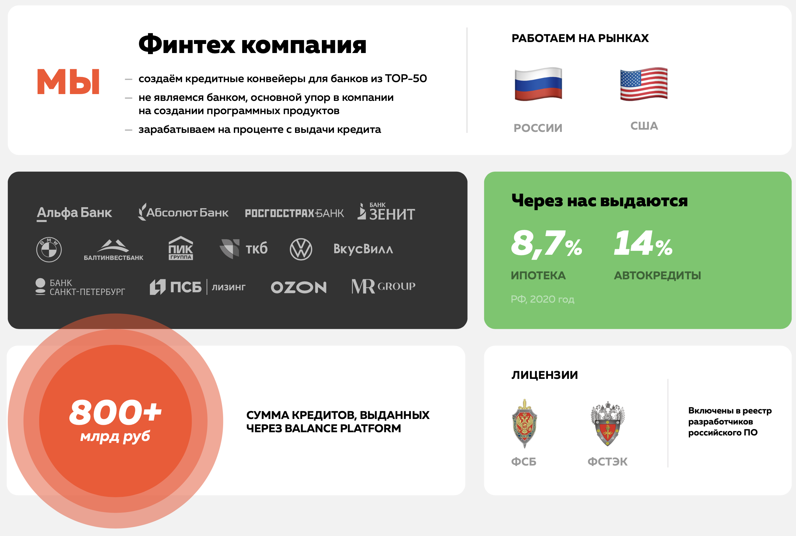
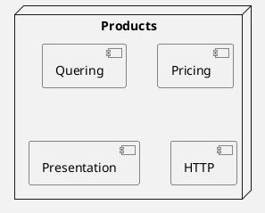
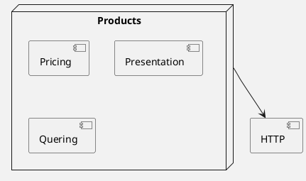
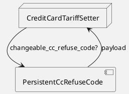

<style>
  section {
    background: #f2f2f2;
  }
  h1,body,li,p { color: black; }

  h1 {
    text-decoration: underline;
    text-decoration-color: #FF5028;
    text-underline-offset: 0.3em;
    text-decoration-thickness: 0.1em;
    padding-bottom: 0.3em;
  }
  img {
    display: block;
    margin-left: auto;
    margin-right: auto;
    width: auto;
    height:70%;
  }
</style>
<!--
_paginate: false
_class: lead
-->


# Extracting Ruby Module

Sergei O. Udalov


---

# Balance Platform




---

# Great Code

  - understandable
  - flexible
  - maintainable

---

# A lot of code!

---




---





---

```ruby
class Products
  BASE_URL = "https://example.com/api"

  def all
    parse get("/products")
  end

  def get(url)
    Faraday.get(URI::join(BASE_URL, url))
  end
end
```

---


```ruby
class Products
  include HTTP

  def all
    parse get("https://example.com/api/products")
  end
end

module HTTP
  BASE_URL = "https://example.com/api"

  def get(url)
    Faraday.get(URI::join(BASE_URL, url))
  end
end
```

---


```ruby
module HTTP
  def connection
    @connection ||= Faraday.new(url: Settings.alfa_api.base_url) do |conn|
      conn.response(:logger, ::Logger.new(STDOUT), bodies: true)
      conn.options[:timeout] = REQUEST_TIMEOUT
      conn.headers['Content-Type'] = 'application/json'
      conn.headers['Accept'] = 'application/json'
      conn.adapter Faraday.default_adapter
    end
  end

  def add_authorization!(request)
    header = Faraday::Request
      .lookup_middleware(:authorization)
      .header(:Bearer, AlfaToken.get)

    request.headers[Faraday::Request::Authorization::KEY] = header
  end
end
```

---

```ruby
class CreateFieldsForm < Web::BaseSchema
  include TariffCalculator
  include DadataFields
  include WebDefaults
  include FormExistence
  include CodeNumberCheck
  include VerificationFields
  include CrmpRequest
  include PartnerData
end
```

---

```ruby
module MoneyMath
  def self.round_to_cents(cents)
    return if cents.nil?

    cents.to_i / 100 * 100
  end
end
```

<!-- _footer: → issues -->

---


# Issues

* broken incapsulation
* stateless
* cyclic dependencies
* difficult to reuse
* difficult to test


<!-- _footer: → incapsulation -->

---

# Broken Incapsulation


  * global methods
  * global state
  * intersaction

---

<!-- header: Broken Incapsulation -->


```ruby
module IndexQueryParamsParts
  DEFAULT_PAGE_SIZE = 100

  def page_size
    params[:page_size] ? params[:page_size].to_i : DEFAULT_PAGE_SIZE
  end

  def field_names
    @field_names ||= Field.where(searchable: true).pluck(:name).map(&:to_s)
  end
end
```


---

```ruby
module QueueLatencyChecker
  def queue_full?(queue)
    return false unless queue_max_latency(queue).present?
    return false unless queue_max_size(queue).present?

    (latency(queue) > queue_max_latency(queue)) || (queue_size(queue) > queue_max_size(queue))
  end

  def latency(queue)
    queue(queue).latency
  end

  def queue_size(queue)
    queue(queue).size
  end

  def queue(queue)
    Sidekiq::Queue.new(queue)
  end

  def queue_max_latency(queue)
    Settings.queue_max_latency[queue]
  end

  def queue_max_size(queue)
    Settings.queue_max_size[queue]
  end
end
```


<!-- _footer: → stateless -->

---

<!-- header: "" -->

# Stateless


  * too many args
  * no initializer
  * each method is initializer
  * procedural programming

---

<!-- header: Stateless -->

```ruby
module MoneyMath
  def self.round_to_cents(cents)
    return if cents.nil?

    cents.to_i / 100 * 100
  end

  # 100.00 -> 100_00
  def self.to_cents(amount)
    return if amount.nil?

    (amount.to_f * 100).to_i
  end

  def self.to_rubs(amount)
    return if amount.nil?

    amount.to_f / 100
  end

  # 5_000_00 -> 5 000
  def self.to_hundreds(amount)
    return if amount.nil?

    amount.to_i / 100
  end
end
```

<!-- _footer: → cyclic dependencies -->

---

<!-- header: "" -->

# Cyclic Dependencies

---

<!-- header: Cyclic Dependencies -->

```ruby
module PersistentCcRefuseCode
  CODE = 'MR006С'

  def current_cc_refuse_code
    payload[:credit_card_refuse_code]
  end

  def persistent_cc_refuse_code?
    current_cc_refuse_code == CODE
  end

  def changeable_cc_refuse_code?
    !persistent_cc_refuse_code?
  end
end
```

---





<!-- _footer: → reuse -->

---

<!-- header: "" -->

# Difficult to Reuse

  * high coupling
  * unlcear responsibility

---

<!-- header: Difficult to Reuse -->

```ruby
module FormExistence
  def form_exists?(form_id)
    form_id && CashCore::Form.where(id: form_id).exists?
  end

  def form_exist_errors
    {
      errors: {
        form_id: I18n.t(:exists, scope: 'errors.messages'),
      },
    }
  end
end
```

---


```ruby
module WebDefaults
  ALLOWED_SALES_CHANNEL_IDS = [2, 3, 5, 9]

  def with_web_default_fields(raw_params, sales_channel_id)
    return raw_params unless sales_channel_id.to_i.in?(ALLOWED_SALES_CHANNEL_IDS)

    raw_params.dup.reverse_merge!(
      {
        tariff_name: tariff_name(raw_params[:tariff_default]),
      }
    )
  end

  private

  def tariff_name(tariff_default)
    tariff_default&.downcase == 'партнерский' ? 'Партнерский' : 'Гибрид'
  end
end
```

<!-- _footer: → testing -->

---

<!-- header: "" -->


# Testing

  * stub class
  * no tests
  * DRY tests

<!-- _footer: → class -->

---

<!-- header: "" -->


# Class Inside

---

<!-- header: "Class Inside" -->


```ruby
module TariffCalculating
  def tariff_amount(invoker_id:, term_request:, loan_amount_request:, insurance_data: nil)
    Tariff.new(
      invoker_id: invoker_id,
      invoker_type: :account,
      payload: {
        loan_term_request: term_request,
        loan_initial_amount_request: loan_amount_request,
        insurance_data: insurance_data,
      }
    ).amount
  end
end
```

---

# Issues

* where is implementation?
* no constructor

---

```ruby
class CreateFieldsForm < Web::BaseSchema
  include TariffCalculator
  include DadataFields
  include WebDefaults
  include FormExistence
  include CodeNumberCheck
  include VerificationFields
  include CrmpRequest
  include PartnerData
end
```

<!-- _footer: → class -->

---

<!-- header: "" -->

# New Class

---

<!-- header: "New Class" -->


```ruby
class CreateFieldsForm < Web::BaseSchema
  def form_data
    return nil unless valid?

    @form_data = fields_data.merge(
      tariff_amount: tariff.amount
    )
  end

  def tariff
    Tariff.new(
      invoker_id: invoker_id,
      invoker_type: :account,
      payload: {
        loan_term_request: term_request,
        loan_initial_amount_request: loan_amount_request,
        insurance_data: insurance_data,
      }
    )
  end
end
```

---

<!-- header: "" -->

# When to use modules

  * namespace
  * extension

---

# Module Name

  * adjective `Enumerable` `Persisted`
  * role `Reader` `Model`

---


# Summary

  * `include` makes your class larger
  * class-powered modules
  * extract new classes
  * reduce coupling
  * use `rubocop`


---

# What next?

  * "Practical Object-Oriented Design in Ruby: An Agile Primer" by Sandi Metz
  * "Patterns of Enterprise Application Architecture" by Martin Fowler
  * "Elegant Objects" by Yegor Bugayenko


---

# Thank you!


"Extracting Ruby Module" by Sergei O. Udalov

Balance Platform

Slides: https://tinyurl.com/ytw5wvx6
email: sergei@udalovs.ru


