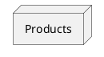
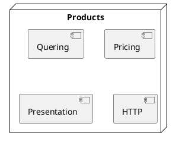
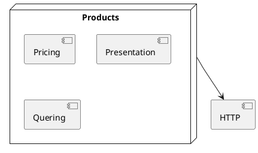

<style>
  section {
    background: white;
  }
  h1,body,li,p { color: black; }

  h1 {
    text-decoration: underline;
    text-decoration-color: #FF5028;
    text-underline-offset: 0.3em;
    text-decoration-thickness: 0.1em;
    padding-bottom: 0.3em;
  }
  img {
    display: block;
    margin-left: auto;
    margin-right: auto;
    width: 80%;
  }
</style>
<!--
_paginate: false
_class: lead
-->


# Extend with Module

Sergei O. Udalov

---




---




---





---

# Why to Extract?

- SRP
- Reuse


---

```ruby
class Products
  def all
    http_get("https://example.com/api/products")
  end

  def request(url, q: {})
    @response = JSON.parse(Faraday.get(url, query(q)))
  end

  def query(q)
    { token: ENV["TOKEN"] }.merge(q)
  end
end
```

---


```ruby
class Products
  include HTTP

  def all
    http_get("https://example.com/api/products")
  end
end

module HTTP
  def request(url, q: {})
    JSON.parse(Faraday.get(url, query(q)))
  end

  def query(q)
    { token: ENV["TOKEN"] }.merge(q)
  end
end
```


---

  - understandable
  - flexible
  - maintainable

---

# Issues

* Incapsulation
* Stateless
* Cyclic Dependencies
* Reuse
* Testing


---

# Incapsulation

---

<!-- header: Incapsulation -->


  * all visible
  * shared state
  * intersaction

---
<!-- header: -->

# Incapsulation

---
<!-- header: -->

---

# Other

* Why
* Naming
