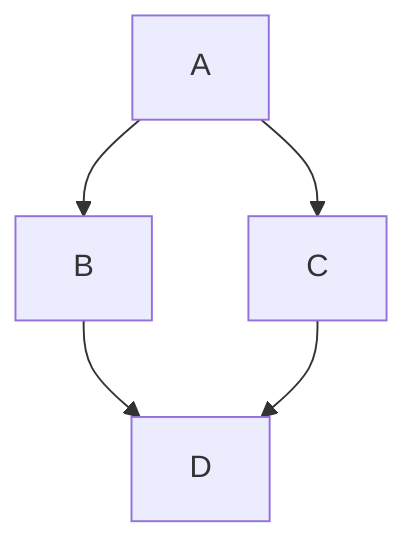

---

paginate: true
class: lead
marp: true
---
<style>
  section {
    background: #f2f2f2;
  }
  h1,body,li,p { color: black; }

  h1 {
    text-decoration: underline;
    text-decoration-color: #FF5028;
    text-underline-offset: 0.3em;
    text-decoration-thickness: 0.1em;
    padding-bottom: 0.3em;
  }
  img {
    display: block;
    margin-left: auto;
    margin-right: auto;
    max-width: 90%;
  }
</style>
<!--
_paginate: false
_class: lead
-->


# Принцип открытости/закрытости

---


> Мы должны иметь возможность расширения системы без необходимости ее модифицировать

S**O**LID by Bob Martin 
https://blog.cleancoder.com/uncle-bob/2014/05/12/TheOpenClosedPrinciple.html

---



```plantuml

package "Shop gem" {
  class Product {
    +price()
  }
}

```

---

---

# Наследование

```plantuml
package "Shop gem" {
  class Product {
    +price()
  }
}

class ProductWithBonusPrice {
  +price()
}

ProductWithBonusPrice -up-|> Product
```

---


# Dependecy Injection

```plantuml
package "Shop gem" {
  class Product {
    +price()
  }
  interface Price {
    +value()
  }
}

Product --* Price

class BonusPrice {
  +value()
}

BonusPrice ..|> Price
```

---

```ruby
# gem
class Product
  def initialize(price:)
    @price = price
  end

  def price
    @price.value
  end
end
```

---

```ruby
# app
class BonusPrice
  def initialize(user:, base_value:)
    @user = user
    @base_value = base_value
  end

  def value
    if user.lucky?
      @base_value * 0.9
    else
      @base_value
    end
  end
end

product = Product.new(BonusPrice.new(user, 10.0))
product.price
```


---

# History

* large gem
* extract core
* extend with modules

---

# In a Wild
