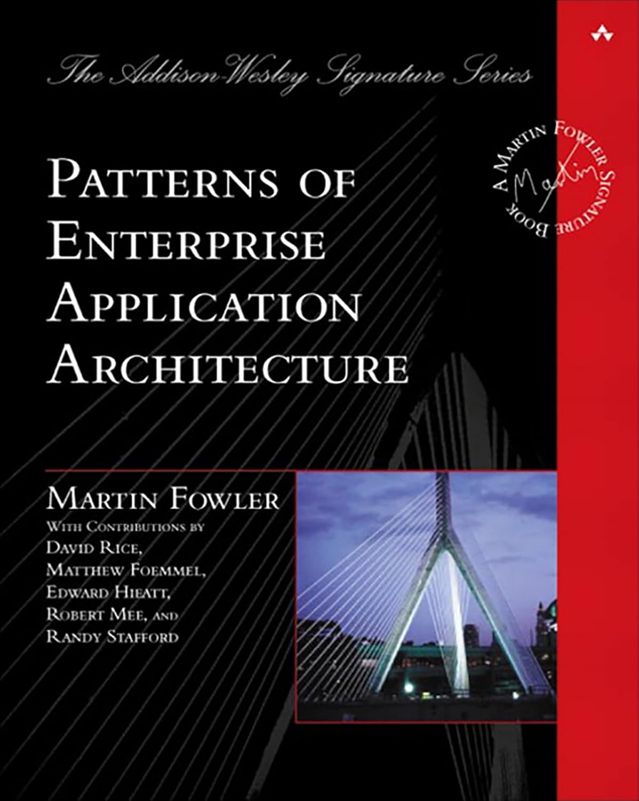

<style>
  img {
    display: block;
  }

  h1, p, ul li { color: black; }
  pre { border: 0px; background: white; }

  footer { color: #bbb }
  footer a { color: #bbb }
</style>

<!-- _paginate: skip -->

# Rich Domain Model

Бизнес-логика без БД

---

<!-- _paginate: skip -->


# Обо мне

- tech lead
- публичные выступления
- @SergeiUdalov

---

<!-- footer: "Rich Domain Model » @SergeiUdalov » ecom.tech" -->

# Digital Asset Management

- 1.2M files, 11TB
- 4854 lines of code (+8344 RSpec)
- 98.48% coverage
- 2 разработчика

---

```ruby
add_filter "bin"
add_filter "config"
add_filter "db"
```

---

<pre>
$ rspec -c --tag fast
Run options: include {:fast=>true}

Randomized with seed 47124
............................................................................
............................................................................
............................................................................
............................................................................
............


Finished in <mark>2.07</mark> seconds (files took 2.16 seconds to load)
317 examples, 0 failures, 0 pending

Coverage report generated for RSpec to
/Users/sergei/code/dam/dam-api/coverage/coverage.xml.
3172 / 4854 LOC (<mark>65.34%</mark>) covered
</pre>

---

<pre>
Top 10 slowest examples (0.68232 seconds, <mark>35.8%</mark> of total time):
    0.15203 seconds ./spec/domain/kinds/image_spec.rb:27
    0.13857 seconds ./spec/interactors/files/create_spec.rb:186
    0.13542 seconds ./spec/repositories/assets_in_directory/filter_spec.rb:39
    0.11972 seconds ./spec/repositories/assets_in_directory/filter_spec.rb:22
    0.02908 seconds ./spec/domain/directory_spec.rb:28
    0.02596 seconds ./spec/domain/file_spec.rb:74
    0.02442 seconds ./spec/domain/file_spec.rb:67
    0.0204 seconds ./spec/outbox/file/create_event_spec.rb:27
    0.01876 seconds ./spec/interactors/google_drive/create_spec.rb:27
    <mark>0.01795 seconds</mark> ./spec/interactors/google_drive/update_spec.rb:30
</pre>

---

# Active Record

---

# Active Record

```ruby
class Article < ApplicationRecord
  def rating
    views + comments.count * 5
  end

  def publish!
    self.update published_at: Time.now
    notify_subscribers
  end

  def as_json
    { id:, title:, published_at: published_at.rfc3339, body: body_html}
  end
end
```

---

# Active Record

```ruby
class Article < ApplicationRecord
  # CalculateArticleRatingInteractor
  def rating
    views + comments.count * 5
  end

  # PublishArticleInteractor
  def publish!
    self.update published_at: Time.now
    notify_subscribers
  end

  # ArticlePresenter
  def as_json
    { id:, title:, published_at: published_at.rfc3339, body: body_html}
  end
end
```

---

```ruby
class Article < ApplicationRecord
end
```

---

# Anemic Domain Model

> The fundamental horror of this anti-pattern is that it's so contrary to the basic idea of object-oriented design; which is to combine data and process together.

https://martinfowler.com/bliki/AnemicDomainModel.html

---

# Тестирование

```ruby
RSpec.describe ArticlesController do 
  context do 
    before { create(:article, slug: "taken-slug") }

    example do 
      post articles_url, params: { article: { slug: "taken-slug" } }
      expect(respose.body).to match /Slug is already taken/
    end
  end
end
```

---

# XXX

```ruby
before {
  allow(Article).to receive(:find_by)
                      .with(slug: "taken-slug")
                      .and_return(build(:article))
}
```

---

<style scoped>
  img {
    width: 40%;
  }
</style>

# Мартин Фаулер


---


<style scoped>
  img {
    width: 40%;
    box-shadow: 10px 5px 5px #aaa;
  }
</style>





---

> Active Record is a good choice for domain logic that isn’t too
complex, such as creates, reads, updates, and deletes. - **Martin Fowler**

---


<center>

```plantuml
allow_mixing

database "DB" as db

  class "Article" as article_ar {
    +save()
    +find(id)
    +publish()
  }

  article_ar ..> db

```

</center>

---

# Domain Model

---

# Data Mapper

> A layer of Mappers (473) that moves data between objects
and a database while keeping them independent of
each other and the mapper itself.


---

# Repository

---


<center>

```plantuml
allow_mixing

database "DB" as db

class "Article" as article_domain {
  published_at
  +publish()
}

class ArticlesMapper {
  +save(article)
  +find(id): Article
}

ArticlesMapper ..> db
ArticlesMapper .up.> article_domain
```

</center>

---

# Жизненный цикл

1. загрузка модели
2. манипуляция с моделью
3. сохранение модели

---


```ruby
class Article < ApplicationRecord
  def rating
    views + comments.count * 5
  end

  def publish!
    self.update published_at: Time.now
    notify_subscribers
  end

  def as_json
    { id:, title:, published_at: published_at.rfc3339, body: body_html}
  end
end
```

---

```ruby
class Article
end
```

---


```ruby
class Article
  def initialize(id:, title:, body:, views: 0, published_at: nil, comments: [])
    @id = id 
    @title = title
    @body = body
    @views = views
    @published_at = published_at
    @comments = comments
  end
end
```

---


```ruby
class Article
  def initialize(id:, title:, body:, views: 0, published_at: nil, comments: [])
    @id = id 
    @title = title
    @body = body
    @views = views
    @published_at = published_at
    @comments = comments
  end

  def rating = @views + @comments.size * 5

  def publish
    @published_at = Time.now
    notify_subscribers
  end
end
```

---

<pre>
class ArticlesRepository
  def find(id)
    record = Database::Article.find(id)

    Article.new(id: record.id, views: record.views,
      title: record.title, <mark>body: record.content</mark>,
      published_at: record.published_at, comments: <mark>ArticleComments.new(record)</mark>)
  end
end
</pre>

---

```ruby
class ArticlesRepository
  def save(article)
    record = Database::Article.find_or_initialize_by(id:)

    record.assign_attributes(views: record.views, title: record.title,
      content: record.body, published_at: record.published_at
    )

    update_comments(article.comments)

    record.save!
  end
end
```

---

# Загрузка модели (1/3)


<pre>
class PublishArticleInteractor
  include Import[repo: "repositories.articles"]

  def call(id)
    <mark>article = repo.find(id)</mark>
  end
end
</pre>

---

# Манипуляция с моделью (2/3)

<pre>
class PublishArticleInteractor
  include Import[repo: "repositories.articles"]

  def call(id)
    article = repo.find(id)
    <mark>article.publish</mark>
  end
end
</pre>

---

# Сохранение (3/3)

<pre>
class PublishArticleInteractor
  include Import[repo: "repositories.articles"]

  def call(id)
    article = repo.find(id)
    article.publish
    <mark>repo.save article</mark>
  end
end
</pre>

---

# Тестирование

```ruby
let(:article) { Article.new(id: 1, ...) }

describe "#publish" do
  before { article.publish }
  it { expect(article.published_at).to eq Time.now }
end

```

---

# Тестирование

```ruby
let(:article) { Article.new(id: 1, views:, comments:, ...) }

describe "#rating" do
  let(:views) { 1 }
  let(:comments) { [Comment.new(text: "hello", ...)] }
  it { expect(article.rating).to eq 6 }
end

```

---

```ruby


RSpec.describe ArticlesController do 
  let(:articles) { Testing::FakeArticlesRepository.new }
  before { DependenciesContainer.stub(:articles, articles) }
  after { DependenciesContainer.unstub(:articles) }

  context do 
    before { articles.save Article.new(id: 1, slug: "taken-slug", ...) }

    example do 
      post articles_url, params: { article: { slug: "taken-slug" } }
      expect(respose.body).to match /Slug is already taken/
    end
  end
end
```

---

# Что еще?

* Dirty
* Relations
* IdentityMap
* PubSub

---

# rom-rb

Ruby object mapper

---

> If you have fairly simple business logic, you probably 
won’t need a Domain Model (116) or a Data Mapper

---

# Summary

---

# Links

- <https://martinfowler.com/bliki/AnemicDomainModel.html>
- patterns book

