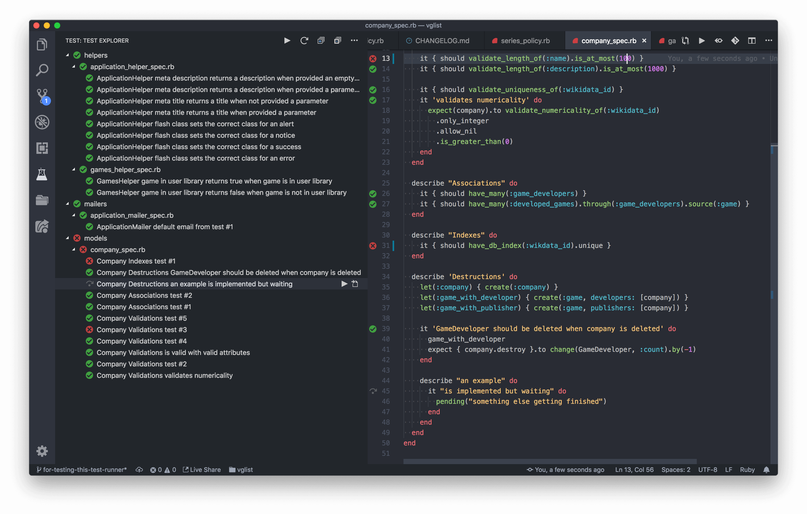
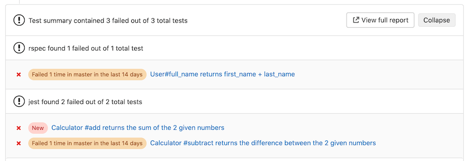
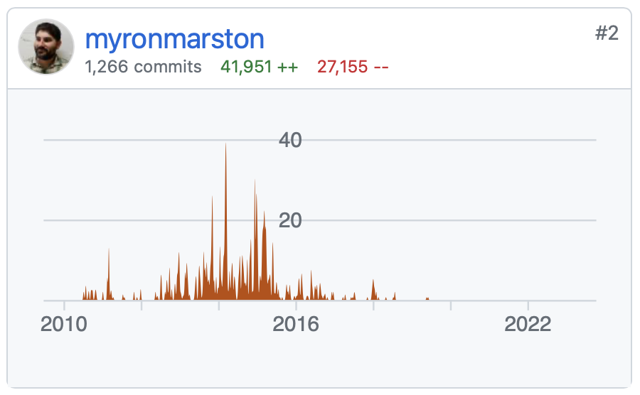
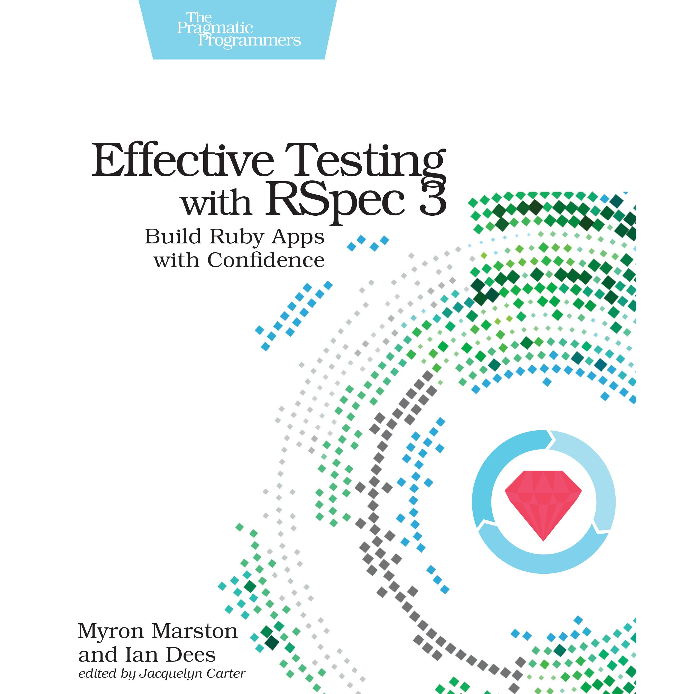

---

marp: true
paginate: true

---


<style>
  img {
    display: block;
    max-height: 100%;
    max-width: 80%;
  }


  h1, p, ul li { color: black; }
  pre { border: 0px; background: white; }

  footer { color: #bbb }
  footer a { color: #bbb }
</style>


<!-- _paginate: skip -->


# RSpec. Эффектиность

@SergeiUdalov, PTL DAM, Samokat.tech

---


# Сергей Удалов


- PTL DAM, Samokat.tech
- тимлид с 2017
- пишу тесты на RSpec с 2009
- разработчик с 2006
- финтех, платные дороги, SEO-инструменты, СМИ, HR

---

<!-- footer: https://bit.ly/3M2y1xo › @SergeiUdalov › Samokat.tech  -->

# Тестирование важно

1. поддерживаемость
2. быстрая обратная связь
3. дизайн кода
4. документирование
5. это прикольно

---

<!-- _footer: "" -->
<!-- _class: invert -->


---

<style scoped>
img { width: 400px }
</style>

# Быстрая обратная связь

---

# Проблемы

1. долго ждать
2. неудобно запускать
3. ненадежность

---

# Производительность


<!-- _footer: Photo by Marc Sendra Martorell -->

---

# Profile

```bash
$ rspec --profile 5

..............

Top 5 slowest examples (4.02 seconds, 57.4% of total time):
  Profile
    0.85078 seconds ./spec/profile_spec.rb:6
  Profile
    0.81927 seconds ./spec/profile_spec.rb:7
  Profile
    0.81688 seconds ./spec/profile_spec.rb:8
  Profile
    0.81053 seconds ./spec/profile_spec.rb:11
  Profile
    0.72669 seconds ./spec/profile_spec.rb:9
```

---

# Медленный контекст

```ruby
let(:response) { Internet.new.get('http://example.com/test') }

it { expect(response['x-time'].to_f).to be < 0.1 }
it { expect(response.status).to eq 200 }
```

---

```ruby
describe 'Response' do
  let(:response) { Internet.new.get('http://example.com/test') }

  it {
    expect(response['x-time'].to_f).to be < 0.1 # fail
    expect(response.status).to eq 200 # unknown
  }
end
```

---

# Before All

```ruby
before(:all) { @response = Internet.new.get('http://example.com/test') }

it { expect(@response['x-time'].to_f).to be < 0.1 }
it { expect(@response.status).to eq 200 }
```


---

# `:aggregate_failures`

```ruby
describe 'Response', :aggregate_failures do
  let(:response) { Internet.new.get('http://example.com/test') }

  it {
    expect(response['x-time'].to_f).to be < 0.1
    expect(response.status).to eq 200
  }
end
```

---


<pre>
Failures:

  1) Aggregate Failures Response aggregate is expected to eq 200
     Got 2 failures:

     <mark>1.1) Failure/Error: expect(response['x-time'].to_f).to be < 0.1</mark>

            expected: < 0.1
                 got:   0.2
          # ./spec/aggreagte_failures_spec.rb:37:in `block (3 levels) in <top (required)>'

     <mark>1.2) Failure/Error: expect(response.status).to eq 200</mark>

            expected: 200
                 got: 201

            (compared using ==)
          # ./spec/aggreagte_failures_spec.rb:38:in `block (3 levels) in <top (required)>'
</pre>

---

# Долгий старт

<pre>
$ rspec spec/policies/user_policy_spec.rb
................................

Finished in 0.01547 seconds (files took <mark>12.75</mark> seconds to load)
32 examples, 0 failures
</pre>

---

<style scoped>
img { width: 400px }
</style>

# Spring


```plantuml
RSpec -> Spring: run #1
Spring -> Spring: load Rails
Spring -> RSpec: result #1
RSpec -> Spring: run #2
Spring -> RSpec: result #2
```

---

```ruby
gem 'spring-commands-rspec', group: :development
```

---

<pre>
$ rspec spec/policies/user_policy_spec.rb
<mark>Running via Spring preloader in process 45148</mark>
................................

Finished in 0.01284 seconds (files took <mark>0.09912</mark> seconds to load)
32 examples, 0 failures
</pre>

---

<pre>
$ rspec spec/policies/user_policy_spec.rb
Running via Spring preloader in process 45148
................................

Finished in <mark>0.01284</mark> seconds (files took 0.09912 seconds to load)
32 examples, 0 failures
</pre>


---

```ruby
class GithubUser
  def initialize(name)
    @name = name
  end
    
  def data = JSON.parse(Faraday.get(url).body, symbolize_names: true)
  def url = "https://api.github.com/users/#{@name}"

  def blog = data[:blog]
end
```

---

```ruby
require 'rails_helper'

RSpec.describe GithubUser do
  subject(:user) { described_class.new("sergio-fry") }

  it { expect(user.blog).to eq "https://sergei.udalovs.ru" }
end
```

---

# Double

```ruby
require 'lib/github_user'

RSpec.describe GithubUser do
  subject(:user) { described_class.new("sergio-fry", internet:) }
  let(:internet) {
    double(
      get: double(body: '{"blog": "https://sergei.udalovs.ru"}')
    )
  }

  it { expect(user.blog).to eq "https://sergei.udalovs.ru" }
end
```

---

# Fake Object

```ruby
module Testing
  class FakeInternet
    def get(url)
      sleep @delay

      Response.new(@data[url], status: 200)
    end

    def put(url, body) = @data[url] = body
    def set_delay(new_delay) = @delay = new_delay
  end
end
```

---

```ruby
before { internet.set_delay(10) }

it { expect(user.blog).to raise_error(Timeout::Error) }
```

---


---

# Spec Helpers

- spec_helper
- rails_helper
- graphql_helper
- integration_helper


---


# Запуск тестов


<!-- _footer: Photo by Bill Jelen -->

---


# Что именно запускать

1. `rspec`
2. `rspec spec/models`
3. `rspec spec/**/*user*`
4. `rspec spec/models/user_spec.rb`
5. `rspec spec/models/user_spec.rb:42`

---

# Fail Fast

```bash
$ rspec --fail-fast

........F
```

---

# Only Failures

```bash
$ rspec --only-failures
Run options: include {:last_run_status=>"failed"}

FFFFFFF
```

---

# Next Failure

```bash
$ rspec --next-failure
Run options: include {:last_run_status=>"failed"}
F
```

---

# Tags

```ruby
# rspec --tag @caching
context "when caching enabled", caching: true do
  # ...
end

# rspec --tag ~@caching
context "when caching disabled", caching: false do
  # ...
end
```

---

```bash
rspec --tag @integration --tag ~@caching
```

---

# .rspec

```
--require spec_helper
--progress documentation
```

---

# .rspec-local

```bash
--exclude spec/integration/**
--tag ~@flaky
--seed 123
```

---

```bash
echo ".rspec-local" >> .gitignore
```

---

<style scoped>
  img {
    display: block;
    max-width: 70%;
  }
</style>

# Запуск из среды разработки



---

# Надежность


<!-- _footer: Photo by iMattSmart -->

---

```ruby
before { report.update }
it { expect(report.updated_at.hour).to eq Time.now.hour }
```

---

# Timecop

```ruby
before { Timecop.travel '2023-01-01 12:00' }

before { report.update }
it { expect(report.updated_at.hour).to eq Time.now.hour }

after { Timecop.return }
```

---

# ActiveSupport::Testing::TimeHelpers

```ruby
before { travel_to '2023-01-01 12:00' }

before { report.update }
it { expect(report.updated_at.hour).to eq Time.now.hour }

after { travel_back }
```

---

# Random Seed

```ruby
RSpec.configure do |config|
  Kernel.srand config.seed
  config.order = :random
end
```

```bash
$ rspec --seed 18281

Randomized with seed 18281
.FFFF...............

```


---

# Ошибки


<!-- _footer: Photo by Marianna Smiley -->

---

# Настройка CI

1. не запускается
2. тесты после линтера
3. удобный вывод

---

# JUnit Format

`rspec --format RspecJunitFormatter --out rspec.xml`



---

# Всегда полное окружение

```bash
--require rails_helper
```

---

# Случайные значения

```ruby
factory :user do
  email { FFaker::Internet.email }
end
```

---

# Verifying Double

```ruby
require 'lib/cache' # dependency

let(:cache) { instance_double(Cache, get: 123) }
```

---

# Тест после кода

1. ручной дебаг
2. хуже API
3. меньше творческих сил

---

# Редкий запуск

---


# Что делать?

1. часто запускайте тесты
2. изучайте инструменты
3. настройте среду разработки
4. читайте тесты библиотек
5. читайте книги

---





---

# Ссылки

1. `rspec --help`
2. https://github.com/connorshea/vscode-ruby-test-adapter
3. https://youtu.be/oNIAJtWuHKg "RSpec. Поддерживаемость"
4. https://github.com/sergio-fry/spec_helper
5. https://github.com/sergio-fry/nvim-config
6. @SergeiUdalov
