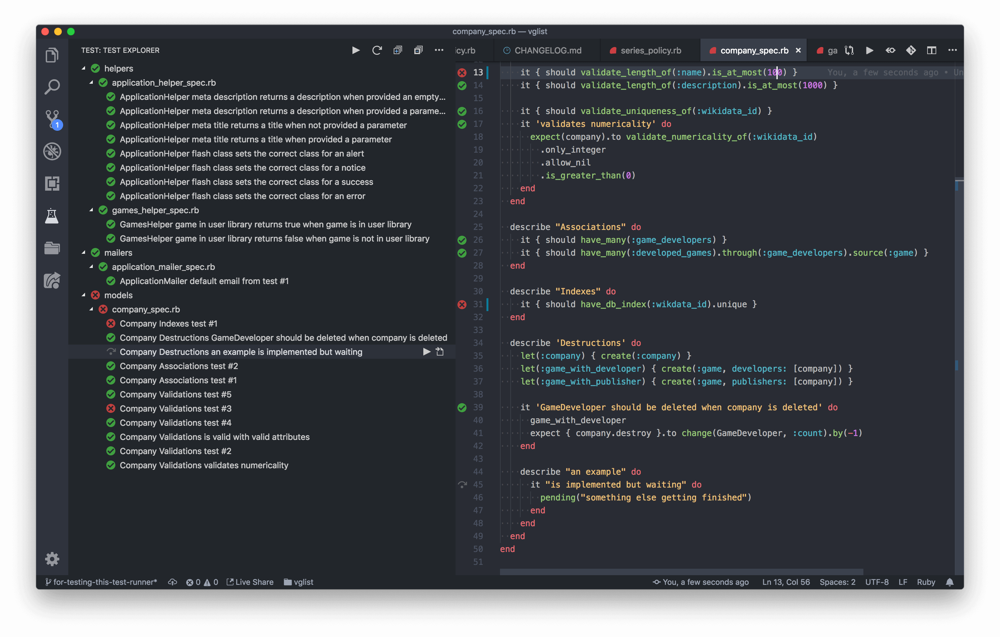
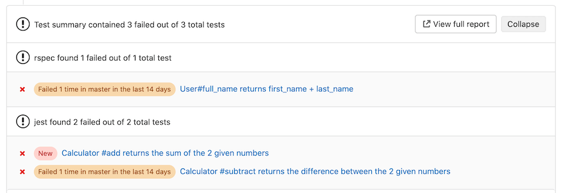
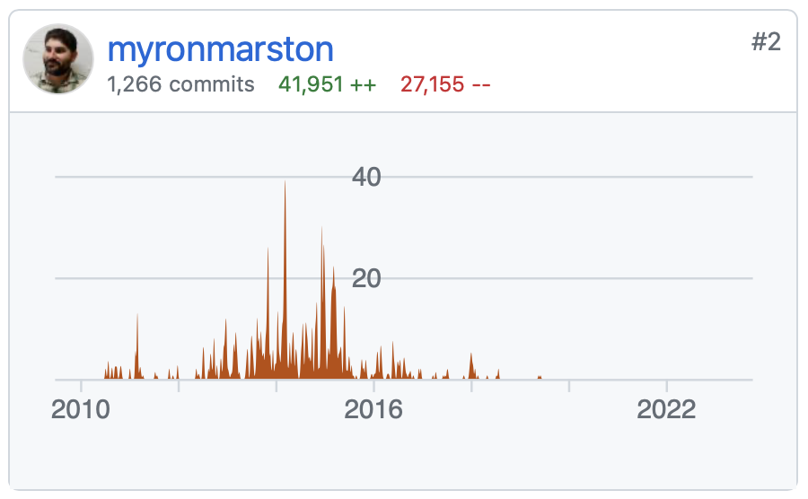

---

marp: true
paginate: true

---


<style>
  img {
    display: block;
    max-height: 100%;
    max-width: 80%;
  }


  h1, p, ul li { color: black; }
  pre { border: 0px; background: white; }

  footer { color: #bbb }
  footer a { color: #bbb }

</style>


<!-- _paginate: skip -->


# RSpec. Эффектиность

@SergeiUdalov, PTL DAM, Samokat.tech

---


# Сергей Удалов


- PTL DAM, Samokat.tech
- тимлид с 2017
- пишу тесты на RSpec с 2009
- разработчик с 2006
- финтех, платные дороги, SEO-инструменты, СМИ, HR

---
<!-- footer: https://bit.ly/3M2y1xo › @SergeiUdalov › Samokat.tech  -->

# Тестирование важно

* поддерживаемость
* быстрая обратная связь
* дизайн кода
* документирование
* это прикольно

---

# RSpec. Поддерживаемость


---

# Быстрая обратная связь

---

# Проблемы

* долго ждать
* неудобно запускать
* ненадежность

---

# Производительность


<!-- _footer: Photo by Marc Sendra Martorell -->

---

# Profile

```bash
$ rspec --profile 5

..............

Top 5 slowest examples (4.02 seconds, 57.4% of total time):
  Profile
    0.85078 seconds ./spec/profile_spec.rb:6
  Profile
    0.81927 seconds ./spec/profile_spec.rb:7
  Profile
    0.81688 seconds ./spec/profile_spec.rb:8
  Profile
    0.81053 seconds ./spec/profile_spec.rb:11
  Profile
    0.72669 seconds ./spec/profile_spec.rb:9
```

---

# Single Expectation

```ruby
let(:response) { Internet.new.get('http://example.com/test') }

it { expect(response['x-time'].to_f).to be < 0.1 }
it { expect(response.status).to eq 200 }
```

---

```ruby
describe 'Response' do
  let(:response) { Internet.new.get('http://example.com/test') }

  it {
    expect(response['x-time'].to_f).to be < 0.1
    expect(response.status).to eq 200
  }
end
```

---

# `:aggregate_failures` tag

```ruby
describe 'Response', :aggregate_failures do
  let(:response) { Internet.new.get('http://example.com/test') }

  it {
    expect(response['x-time'].to_f).to be < 0.1
    expect(response.status).to eq 200
  }
end
```
---

# Долгий старт

<pre>
$ rspec
................................

Finished in 0.01547 seconds (files took <mark>12.75</mark> seconds to load)
32 examples, 0 failures
</pre>

---

<style scoped>
img { width: 400px }
</style>

# Spring


```plantuml

RSpec -> Spring: run #1
Spring -> Spring: load Rails
Spring -> RSpec: result #1
RSpec -> Spring: run #2
Spring -> RSpec: result #2
```

---

```ruby
gem 'spring-commands-rspec', group: :development
```

---

<pre>
$ rspec
<mark>Running via Spring preloader in process 45148</mark>
................................

Finished in 0.01284 seconds (files took <mark>0.09912</mark> seconds to load)
32 examples, 0 failures
</pre>


---

# Изоляция


---

```ruby
require 'rails_helper'

RSpec.describe Ages do
  subject(:ages) { described_class.new(users:) }
  let(:users) { [create(:user, age: 25)] }

  it { expect(ages.average).to eq 25 }
end
```

---

# Double

```ruby
require 'lib/ages'

RSpec.describe Ages do
  subject(:ages) { described_class.new(users:, cache:) }
  let(:users) { [double(:user, age: 25)] }
  let(:cache) { double(:cache, value: nil) }

  it { expect(ages.average).to eq 25 }
end
```

---

# Fake Object

```ruby
module Testing
  class FakeCache
    def initialize
      @data = {}
    end
  
    def get(key) = @data[key]
    def put(key, value) = @data[key] = value
  end
end
```
---

# Spec Helpers

* spec_helper
* rails_helper
* graphql_helper
* integration_helper


---


# Запуск тестов


<!-- _footer: Photo by Bill Jelen -->

---


# Что именно запускать

* `rspec`
* `rspec spec/models`
* `rspec spec/**/*user*`
* `rspec spec/models/user_spec.rb`
* `rspec spec/models/user_spec.rb:42`

---

# Fail Fast

```bash
$ rspec --fail-fast

........F
```

---

# Only Failures

```bash
$ rspec --only-failures
Run options: include {:last_run_status=>"failed"}

FFFFFFF
```

---

# Next Failure

```bash
$ rspec --next-failure
Run options: include {:last_run_status=>"failed"}
F
```

---

# Tags

```ruby
# rspec --tag @caching
context "when caching enabled", caching: true do
  # ...
end

# rspec --tag ~@caching
context "when caching disabled", caching: false do
  # ...
end
```

---

```bash
rspec --tag @integration --tag ~@caching
```

---

# .rspec

```
--require spec_helper
--progress documentation
```

---

# .rspec-local

```bash
--exclude spec/integration/**
--tag ~@flaky
--seed 123
```

---

```bash
echo ".rspec-local" >> .gitignore
```

---

<style scoped>
  img {
    display: block;
    max-width: 70%;
  }
</style>

# Запуск из среды разработки



---

# Надежность


<!-- _footer: Photo by iMattSmart -->

---


# Timecop

```ruby
before { Timecop.travel '2023-01-01 12:00' }
after { Timecop.return }
```

---

# Random Seed

```ruby
Kernel.srand config.seed
```

```bash
$ rspec --seed 18281

Randomized with seed 18281
.FFFF...............

```


---

# Ошибки


<!-- _footer: Photo by Marianna Smiley -->

---

# Не настроен CI

<!--
* источник правды
* Merge request
* полнота обратной связи
-->

---

# JUnit Format

`rspec --format RspecJunitFormatter --out rspec.xml`



---

# Всегда полное окружение

```bash
--require rails_helper
```

---

# Factory

```ruby
factory :user do
  email { FFaker::Internet.email }
end
```

---

# Verifying Double

```ruby
require 'lib/cache' # dependency

let(:cache) { instance_double(Cache, get: 123) }
```

---

# Тест после кода

* ручной дебаг
* отравление техническими деталями
* тратим мыслетопливо на рутину

---

# Редкий запуск

---


# Что делать?

* изучайте инструменты
* настройте среду разработки
* читайте тесты библиотек
* читайте книги

<!--

RSpec tested with Cucmeber

 -->

---




---

# Ссылки

* https://youtu.be/oNIAJtWuHKg "RSpec. Поддерживаемость"
* `rspec --help`
* https://github.com/sergio-fry/spec_helper
* https://github.com/sergio-fry/nvim-config
* @SergeiUdalov
