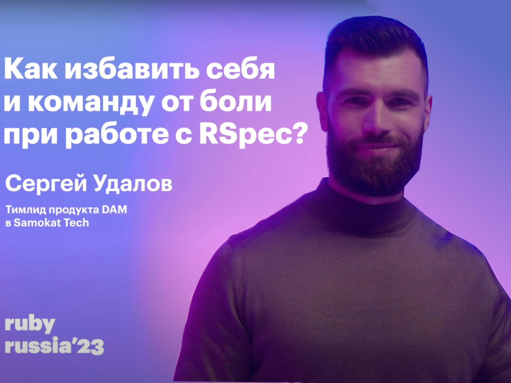

---

marp: true
paginate: true
size: 4:3

---

<!-- _paginate: skip -->

# RSpec. Review

Сергей Удалов, PTL DAM at Samokat.tech

---

# Сергей Удалов

- PTL DAM, Samokat.tech
- тимлид с 2017
- пишу тесты на RSpec с 2009
- разработчик с 2006
- финтех, платные дороги, SEO-инструменты, СМИ, HR

---

<!-- _footer: "" -->
<!-- _class: invert -->

---

<!-- footer: bit.ly/3SBDkYI › @SergeiUdalov › Samokat.tech  -->

TODO: Зачем это доклад?

---

# Рассмотрим

dry-rb gitlab hanami pg rom-rb
rspec ruby-concurrency vcr

---

# План

1. Конфигурация
2. Контекст
3. Тестовые классы
4. Expectation
6. Faker
7. Helpers
8. Выразительность
5. Acceptance
9. Библиотеки

---

!!!include(parts/config.md)!!!
!!!include(parts/context.md)!!!
!!!include(parts/context_classes.md)!!!
!!!include(parts/expectation.md)!!!
!!!include(parts/faker.md)!!!
!!!include(parts/helpers.md)!!!
!!!include(parts/semantic.md)!!!
!!!include(parts/acceptance.md)!!!
!!!include(parts/libraries.md)!!!

# Итоги

1) тестируй
2) тестируй важное
3) читай чужой код

---

# Links

1. https://youtu.be/oNIAJtWuHKg "RSpec. Поддерживаемость"
1. https://bit.ly/3QSGIxh Другие выступления

---

# Спасибо!
