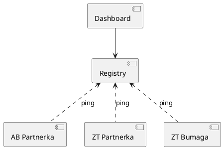

<style>
  section {
  }
  h1,body,li,p { color: black; }

  h1 {
    text-decoration: underline;
    text-decoration-color: #FF5028;
    text-underline-offset: 0.3em;
    text-decoration-thickness: 0.1em;
    padding-bottom: 0.3em;
  }
  img {
    display: block;
    margin-left: auto;
    margin-right: auto;
    max-width: 90%;
  }
</style>
<!--
_paginate: false
_class: lead
-->


# Ruby Platform

Sergei O. Udalov

---
<!-- footer: Ruby Platform -->

# Intro


---

# Challenges

* bootstrap
* best practices
* deliver new features
* lot of apps

---

# Application Boilerplate

* configs
* HTTP
* RMQ

---

# High Availability

* Redis Sentinel
* RMQ cluster
    
---

# Database

* migrations
* database reconnect

---

# Monitoring

* healthcheck
* monitoring

---

# Background Jobs

```ruby
class MegafonResponseWorker < BP::RPC::ResponseWorker
  queue :megafon
  
  def work(data)
    # ...
  end
end 
```

---

# Logging

---

# Documentation

---

# Gitlab CI

* build
* tests
* linter
* security checks
* performance issues

---

# Error handling

* reporting
* retries

---

# Up to Date

* ruby version
* gems

---

# Efficency

* grape
* sinatra / roda / hanami

    
---

# Mount Rack

```ruby

match "/api" => MySinatraApp, anchor: false

```

---

# Dev Tools

* docker compose
* dip.yml

---

# Feature Toggling

---

# Rails Template

* bootstrap
* CI
* testing
* healthcheck

<!-- _footer: https://gitlab.infra.b-pl.pro/lib/gems/rails_template -->

---

<!-- header: Rails Template -->

```ruby
gem_group :development, :test do
  gem "rspec-rails"
end
```

---

```ruby
generate(:scaffold, "person name:string")
```

---

```ruby
file 'app/components/foo.rb', <<-CODE
  class Foo
  end
CODE
```

---

# Issues

* missing features
* no update workflow
* no outdate versions monitoring

---

# New Features


---

# Updates


---

```ruby
bin/rails app:template LOCATION=http://example.com/template.rb
```

---

# Heatmap

| Project | App       | Platform | Ruby | Redis |
|---------|-----------|----------|------|-------|
| AB Auto | partnerka | 1.0      | 2.4  | no    |
| ZT Auto | partnerka | 1.1      | 2.6  | yes   |
| ZT Auto | bumaga    | 1.9      | 3.2  | no    |

---

# Monitoring



---

<!-- header: "" -->

# Summary

---

# What Next?

* python
* php
* etc..

---

# Links

* https://guides.rubyonrails.org/rails_application_templates.html
* https://gitlab.infra.b-pl.pro/lib/gems/rails_template


---

# Thanks!
