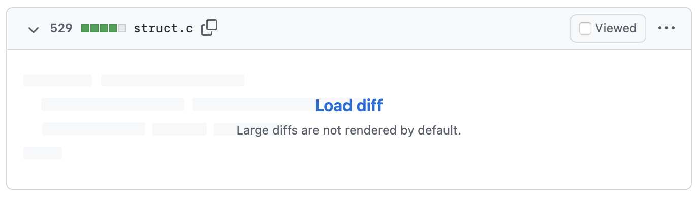

<style>
  section {
  }
  h1,body,li,p { color: black; }

  h1 {
    text-decoration: underline;
    text-decoration-color: #FF5028;
    text-underline-offset: 0.3em;
    text-decoration-thickness: 0.1em;
    padding-bottom: 0.3em;
  }
  img {
    display: block;
    margin-left: auto;
    margin-right: auto;
    max-width: 90%;
  }
</style>
<!--
_paginate: false
_class: lead
-->


# Value Object

Sergei O. Udalov

---

# Definition

> An object that represents a descriptive aspect of the domain with no conceptual identity is called a Value Object

---

# Attributes

* has no identity
* immutable
* short lifetime

---

# Primitives

- String
- Integer
- Date
- ...

---

# Entity vs Value

| Entity | Value |
|--------|-------|
| UserProfile | Age |
| City   | Address |
| Account | Money |
| UserLocation | Location |

---

# Data (Ruby 3.2.rc)

```ruby
Money = Data.define(:amount, :currency)
money = Money.new(100, 'RUB')

moeny.amount
# => 100

money == Money.new(100, 'RUB')
# => true
```

---

# Why Imutable?

--- 

# Imutablity

```ruby
money.amount = 200
# => undefined method `amount=' for #<data Money amount=100, currency="RUB"> (NoMethodError)
```

---

```ruby
Money.new(100, 'RUB') + Money.new(20, 'RUB')
# => Money.new(120, 'RUB')
```

---

# Behaviour


```ruby
Money = Data.define(:amount, :currency) do
  def +(other)
    raise 'Different currencies' if currency != other.currency

    Money.new(amount + other.amount, currency)
  end
end

money = Money.new(100, 'RUB') + Money.new(100, 'RUB')
money.amount
```

---

# Inheritance

```ruby
class Coordinates < Data.define(:x, :y)
  def to_s
    "#{x}, #{y}"
  end
end

class Vector < Coordinates
  def +(other)
    Vector.new(x + other.x, y + other.y)
  end
end
```

---

# Equal?

```ruby
Position = Data.define(:x, :y)
Coordinates = Data.define(:x, :y)

puts Coordinates.new(1, 1) == Coordinates.new(1, 1)
# => true

puts Position.new(1, 1) == Coordinates.new(1, 1)
# => false
```

---

# Naming

> There are only two hard things in Computer Science: cache invalidation and naming things.

*Phil Karlton*

---

# Naming

**data** + behaviour

---

# Struct




<!-- footer: https://github.com/ruby/ruby/pull/6353 -->

---
<!-- footer: "" -->

# Struct

```ruby
Coordinates = Struct.new(:x, :y)

position = Coordinates.new(1, 1)

position == Coordinates.new(1, 1)
# => true

# Agrrr.....
position.x = 2
```

---

# DTO. Anemic Model

---

# Handmade

```ruby
class Coordinates
  attr_reader :x, :y

  def initialize(x, y)
    @x, @y = x, y
  end

  def ===(other)
    other.x == x && other.y == y
  end
end
```

---

# Summary

* immutable
* equal
* performance
* semantics

---

# Links

- https://enterprisecraftsmanship.com/posts/entity-vs-value-object-the-ultimate-list-of-differences/
- https://github.com/ruby/ruby/pull/6353

---

# Thanks!
